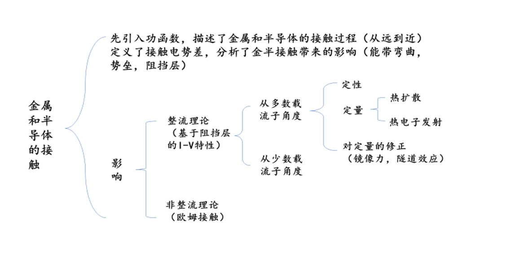
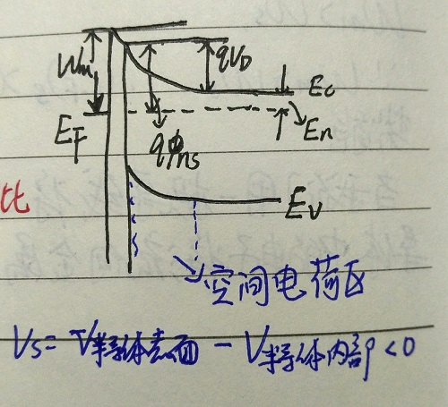
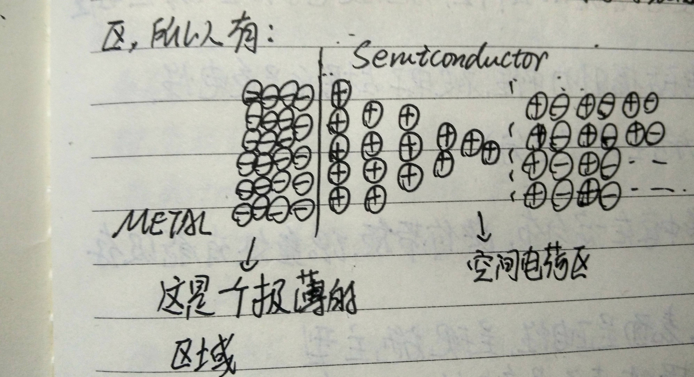
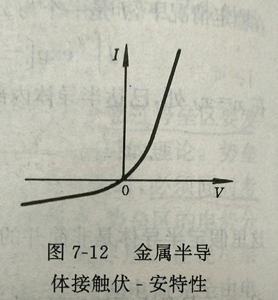

# 第七章 金属和半导体的接触

## 7.1金属半导体接触及其能级图

### 1 功函数

#### 对于金属

T=0K时，金属中的电子填满了费米能级$E_F$以下的所有能级，而高于$E_F$的能级则全空；在T$\neq$0K时，$E_F$ 以下少数电子受激发跃迁至更高能级。所以，虽然金属中的电子能自由运动，但要使电子电子从金属中逸出，需要一定的能量，可以认为金属中的电子是在一个势阱中运动。

金属的功函数定义为： 真空中禁止电子的能量$E_0$ 与费米能级 $E_F$ 之差
$$
W_m =E_0 - (E_F)_S
$$
 $W_m$ 越大，则电子越难离开金属。这也是标志这金属对电子的束缚能力不同的金属，由于$E_F$ 不同，$W_m$ 也不同，一般约为几个 eV

#### 对于半导体

同理，半导体的功函数定义为：$E_0$ 与费米能级之差
$$
W_S = E_0-(E_F)_S
$$
其中，$(E_F)_s$ 与掺杂浓度及材料有关

同时，定义	$Ｘ = E_0 -E_c $ 表示导带底电子逸出半导体所需最小能量，称为电子亲合能

此时，$ W_S = Ｘ + E_c -(E_F)_s=Ｘ+E_n , E_n=E_c-(E_F)_s$ 

###  2.接触电势差

以金属和一块n型半导体为例，它们具有共同的真空静止电子能级$E_0$ ,且 $W_m > W_s $ 

因为 $W_m> W_s$ 所以 $(E_F)_s >(E_F)_m $ 即半导体中电子势能高于金属中电子势能。

当我们用一根很长的导线将二者相连时，二者将构成统一的电子系统，半导体中的电子将流向金属，金属表面带负电（电势降低），半导体表面带正电（电势升高）。

在这过程中，其内部所有和表面的电子能级都相应变化，最终平衡时，金属和半导体的费米能级处于同一个水平（无电子流动）

（PS：因为金属不承担压降，所以其能级的变化压降等全加在半导体上）

在半导体能级变化时，其$E_0,W_s$ 等都发生了变化，如上图所示

此时两者的电势差全部摊在了导线两端，即：
$$
q(V_s'-V_m)=W_m-W_s     
$$
  $V_s' ,  V_m  $  为半导体及金属的电势

此时，定义 
$$
V_{ms} =  V_m - V_s' = (W_s -W_m)/q
$$
接触电势差（负的）

当导线长度变短，金属表面负电荷密度增加，半导体表面正电荷密度也增加

（PS：上述过程相当于两不同电势的金属球相互靠近）

但由于半导体中自由电荷的限制，这些正电荷不能分布在表层的薄层中，（但是金属可以...）

只能分布在表面附近的一个较宽区域（也就是空间电荷区）

此时接触电势差，一部分仍摊在金属和半导体的表面，而有一部分则摊在空间电荷区，于是有：
$$
(W_s-W_m)/q=V_{ms} +V_s
$$
$V_s$ :半导体表面与内部的电势差，表面势

由图可知： 

- 半导体这边的势垒 $ qV_D = -qV_s =W_m - W_S$

- 金属这边的势垒 $ qΦ_{ns} = qV_D +E_n =W_m -Ｘ $

  （感觉势垒和功函数是一个挺重要的概念，但是因为好理解就不多做解释）

**理解：$V_s<0$为什么半导体表面失去电子后，电势却比半导体内部低 （这个是探索了很久才想到的 HH）**

- 从理论上看： $ (W_s -W_m)/q = V_{ms} +V_s $ ,左边为负，当金属和半导体紧密接触时，$V_{ms} → 0$  所以$ V_s<0$ 

- 模型解释：

  我们已知，流向金属的电子不完全由半导体表面提供，也有来自空间电荷区，所以有：

  

虽然相对于半导体的内部，半导体表面失去了更多的电子，但由于离金属带强负电的薄层过近，所以其电势小于内部，所以$V_s$ <0

所以当金属与n型半导体接触，且$ W_m > W_s$ 时，将形成正的空间电荷区，其电场由内指向半导体表面，延伸至金属表面。因此，电子从半导体内部往半导体表面的过程中，需要更多能量，即处在半导体表面的电子能量高于体内，所处能级高于体内。

（能带向上玩去，空间电荷区内电子浓度比体内小得多，因此这是一个高阻区，也就是  **阻挡层** ）

同理可推得：

|             | n型   | p型   |
| ----------- | ---- | ---- |
| $W_m >W_s $ | 阻挡层  | 反阻挡层 |
| $W_m <W_s $ | 反阻挡层 | 阻挡层  |

### 3表面态对接触势垒的影响

（这一小节是对表面态的定性分析，定量分析在第八章的第一节）

因为$ qΦ_{ns} =W_m-Ｘ $  所以对于同一种半导体，不同的金属，其势垒应该与金属的功函数密切相关。但是邪恶的表面态突然出现打破了这一规律。

表面态 分为

- 施主型表面态： 被电子占据时呈中性，施放电子后显正电性

- 受主型表面态：无电子占据时呈中性，被电子占据后呈负电性

  （与半导体掺杂后出现的施主及受主能级区分）

表面态在半导体表面的禁带中存在一定分布，距价带顶 $qΦ_0$  处有能级存在，$qΦ_0$  约为1/3 $E_g$ 

- $qΦ_0$  以下的表面态空着时，表面呈正电性，呈现施主型

- $qΦ_0$ 以下的表面态被电子占据时，表面呈负电性，呈现受主型

  ​

**定性结论：当表面态密度较高时，表面态上积累负电荷，使能带弯曲，可屏蔽金属接触的影响，使得半导体内的势垒高度和金属的功函数几乎无关，接触电势差全降落在两个表面之间**

## 7.2 金属半导体接触整流理论

（本节基于阻挡层，研究电压和电流的关系）

1. 定性理论
2. 定量理论
3. 镜像力和隧道效应的影响
4. 肖特基二极管

### 1.定性理论

处于平衡态的阻挡层中无净电流流过，从半导体进入金属的电子流和从金属进入半导体的电子流大小相同，方向相反，构成动态平衡。

那，当我们在金属端外加电压时，

1. 所加电压  V>0 ，此时金属的电势将升高，其功函数$ W_m→ W_m -V $  

   所以半导体这边的势垒$ qV_D = W_m-W_s $ 将减小，从半导体流向金属的电子将增加

   （类似于pn结正向导通）

2. 所加电压V<0 ， 此时金属的电势将降低，$qV_D $ 增大，从金属流向半导体的电子将增加，但是因为从金属到半导体的势垒很高，所以反向电流很小

   （类似于pn结反向截止）

### 2.定量理论 ： A.扩散理论     B.热电子发射理论

#### A.扩散理论

适用于当势垒的宽度比电子的平均自由程大得多时，电子通过势垒区要发生多次碰撞的厚阻挡层（需同时考虑电子的漂移和扩散运动）

通过一堆复杂的计算和推导可得：

电流密度：$ J_{SD}$ 十分复杂，就参考书本吧

#### 					  **$ J=J_{SD}· [exp(\frac{qV}{k_0 T})]$**  	

1. 当V>0 时，若$qV>>k_0T$  则 **$J=J_{SD} exp(\frac{qV}{K_0T})$**
2. 当V<0 时，$|qV|<<k_0T $  则  $ J=-J_{SD}$

#### B.热电子发射理论

n型阻挡层很薄，电子平均自由程远大于势垒宽度时，无需考虑碰撞，半导体内部的电子只要有足够的能量超越势垒的顶点，即可穿越阻挡层进入金属。

#### 计算后，得总电流密度 **$ J=J_{SD} [exp(\frac{qV}{k_0T})-1]$**

### $J_{SD}=A^*·T^2·exp(-\frac{qΦ_{ns}}{k_0T})$

$A^*$ 为有效理查逊常数 

 热电子向真空发射时 $A^* =A =120A/cm^2 K^2 $  计算时应该会给出 A与 $A^*$ 的比值

### 3.镜像力和隧道效应的影响

上文中提到的扩散理论和热电子发射理论虽然说明了不对称的导电性以及其所描述的高阻方向和低阻方向也和实际情况相符。但理论存在着推导过程模型过于理想，所以要讨论并修正

#### A.镜像力的影响

若电子距离金属表面的距离为X ，则它与感应正电荷间的吸引力，相当于该电子与位于（-X）处的等量正电荷间的吸引力 →→ **镜像力**

考虑镜像力之后，发现阻挡层中的势垒顶向向内移动，不在半导体表面，同时势垒也有所降低。

#### B.隧道效应的影响

由于隧道效应原理，能量低于势垒顶的电子有一定几率穿过这个势垒，穿透几率与电子能量和势垒的宽度有关。

镜像力和隧道效应对于反向特性的影响特别显著，他们引起势垒高度的降低，使反向电流增加。而且随着反向电压越大，势垒降低越显著，反相电流越大。

这也是为什么上图中金属与半导体接触的伏安特性曲线，反向电流不饱和

### 4.肖特基势垒二极管(SBD)

利用金属-半导体整流接触特性制成的二极管

SBD与pn结的异同点

- 同

  都具有类似的I-V特性

  都具有单向导电性

- 异

  ①肖特基二极管比pn结二极管有更好的高频特性

  ②对于同样的使用电流，SBD有较低的正向导通电压（0.3V）左右

  ③对于SBD，其反向电流随着反向电压增加而不饱和

  ​    对于pn结二极管，其反向电流随着反向电压增加而趋于饱和

  ④SBD随着温度增加，反向电流不饱和

  ​     pn结二极管随着温度变化，反向电流变化较小

## 7.3 少数载流子的注入与欧姆接触

### 1.少数载流子的注入

在本章的前两节讨论中，我们只注意到了电子（因为以n型半导体为例），作为多数载流子的运动，而忽略了空穴。所以，现在开始考虑少数载流子对电流的贡献。

在扩散理论中，我们对平衡状态下的金半接触的金属端施加了大小为V的正电压，使半导体端的势垒降低，电子利用扩散运动，从体内往表面移动。燃鹅，n型半导体的势垒及阻挡层都是对于电子而言；对于空穴，这阻挡层便为积累层，在势垒区的表面处空穴浓度最大。因此，当V被施加时，空穴由扩散作用会从表面向体内扩散，形成电流。

这就意味着，**部分正向电流是由少数载流子空穴载荷的  →→ 少数载流子的注入效应**

因此**在金属和n型半导体的整流接触上，加正向电压时，就有空穴从金属流向半导体 → 少数载流子的注入**

加正向电压时，少数载流子电流与总电流之比称为少数载流子的注入比，用	$γ 		$  表示

#### 				$ γ= J_P/J_P+J_n$  

小注入时，$γ	$ 值很小；在大电流条件下，注入比$γ	$ 随着电流密度增大而增大

### 2.欧姆接触 ：金属与半导体接触时所形成的非整流接触

特点：

1. 欧姆接触不产生明显的附加阻抗，而且不会使半导体内部的平衡载流子浓度发生显著的改变
2. 理想欧姆接触的接触电阻与半导体样品或器件相比很小
3. 当有电流流过时，欧姆接触上的电压降远小于样品或器件本身的压降
4. 不影响器件的电压-电流特性
5. 超高频和大功率器件中，欧姆接触是设计和制造的关键问题之一

$ Ge, Si,GaAs$ 等材料有较高的表面态密度，与金属接触都形成势垒。现在，主要利用隧道效应的原理在半导体上制造欧姆接触

当半导体的掺杂浓度很高时，势垒区宽度变薄，隧道电流形成电流的主要成分，其接触电阻很小，可作为欧姆接触

接触电阻: 零偏压下的微分电阻

####  $ R_c = (\frac {dI}{dV})^{-1}_{V=0}$

势垒宽度： 正比于多数载流子浓度

#### $ X_d ∝ \frac{1}{\sqrt{N}} $

当掺杂浓度越高，势垒宽度越小，隧道几率越高，接触电阻越小

**制作欧姆接触最常用的而方法是用重掺杂的半导体与金属接触**

ps：有些公式显示效果不好，我就把它弄成标题了 -w-

