# 金属和半导体的接触

## 金属半导体接触及其能级图

### 金属和半导体的功函数

####费米能级

首先我们要理解一个**费米能级**的概念。费米能级是具有统计学意义的物理概念，并非真实存在的能级。

在**金属**中，费米能级$E_F$具有这样的性质：一定温度时，$E_F$以下的绝大部分能级被电子填满，$E_F$以上的能级基本都是空着的。可以这样形象地理解（在[这个知乎问题](https://www.zhihu.com/question/22560362)上看到的）：

>费米能级是绝对零度下电子所能够占据的最高能级，每个能级上面能够放自旋相反的两个电子。楼梯的比喻不错。设想你有一麻袋苹果（电子），你面前有一个长长的阶梯（能带），你从最下面一级台阶（能级）起往上走，每到一级台阶（能级），就在这一级台阶上面放两个苹果（电子），一直继续下去，到放完为止。此时你站立的台阶，就是费米能级。

在**半导体**中，费米能级经常处于禁带中，它以下的价带几乎被电子填满，而其上面的导带则有很少的电子，当然，禁带中是没有电子的。为了进一步说明半导体中费米能级的意义，引用[这篇博客](http://blog.sina.com.cn/s/blog_6e56343801012xn6.html)的内容如下：

>   对于绝缘体和半导体，Fermi能级则处于禁带中间。特别是本征半导体和绝缘体，因为它们的的价带是填满了价电子（占据几率为100%）、导带是完全空着的（占据几率为0%），则它们的Fermi能级正好位于禁带中央（占据几率为50%）。即使温度升高时，本征激发而产生出了电子-空穴对，但由于导带中增加的电子数等于价带中减少的电子数，则禁带中央的能级仍然是占据几率为50%，所以本征半导体的Fermi能级的位置不随温度而变化，始终位于禁带中央。
>
>   ②Fermi能级实际上起到了衡量能级被电子占据的几率大小的一个标准的作用。在E < EF时，f(E)  > 1/2；在E > EF时，f(E)  < 1/2；在E=EF时，f(E)=1/2。譬如，当(E–EF)  > 5kT时，f(E)  <  0.07，即比EF高5kT的能级被电子占据的几率只有0.7%。因此，EF的高低（位置）就反映了能带中的某个能级是否被电子所占据的情况。Fermi能级上电子占据的几率刚好为50%。
>
>   在温度不很高时，EF以上的能级基本上是空着的（例如，导带就是如此，其中的自由电子很少），EF以下的能级基本上是被电子填满了的（例如，价带就填满了价电子，其中的自由空穴很少）；在EF以上、并越靠近EF（即E-EF越小）的能级，被电子所占据的几率就越大。对于n型半导体，因为导带中有较多的电子（多数载流子），则Fermi能级EF必将靠近导带底（EC）；同时，掺入施主杂质的浓度越高，Fermi能级就越靠近导带底。

这样我们就得到关于半导体费米能级的两个结论：

1.  若一块半导体的费米能级$E_F$靠近导带底$E_c$（在禁带中靠上），则其为N型半导体。若费米能级$E_F$靠近价带顶$E_v$（在禁带中靠下），则其为P型半导体。
2.  半导体的费米能级随杂质浓度变化而变化。

#### 功函数

根据前面的讨论，我们知道，无论是金属还是半导体，其费米能级都是一个假想的能级，低于费米能级的能级上电子几乎填满，而能量高于费米能级的电子几乎没有。因此，费米能级可以说就是一个“水平面”了。将电子从费米能级的状态转变到自由状态所需要的能量就是功函数。假设费米能级为$E_F$，自由电子静止时的能量为$E_0$，则功函数$$W = E_0 - E_F$$。

金属与半导体的功函数可以用下标区别：

金属：$$W_m = E_0 - (E_F)_m$$，半导体：$$W_s = E_0 - (E_F)_s$$

### 接触电势差

首先需要理解一条关于费米能级的原理：当两个物体互相靠近接触时，两个物体不同的费米能级会发生变化，进而相等，成为一个统一的费米系统。

首先我们假设无论是在金属中还是在半导体中，真空静止电子的能量都是$E_0$。接下来应对两个条件分类讨论，即：

1.  半导体是n型还是p型
2.  $(E_F)_m \lt (E_F)_s$ 还是 $(E_F)_m \gt (E_F)_s$

共 $2\times 2=4$ 种情况。

现在以半导体为n型，$(E_F)_m \lt (E_F)_s$为例进行讨论。

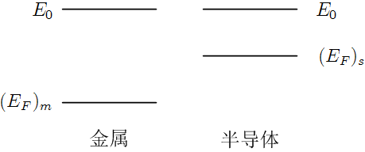

上图展示了金属和半导体还未接触时的费米能级示意图。我们可以看到半导体的费米能级大于金属的费米能级，就好像两杯水，半导体这边的水平面要比金属高一些：

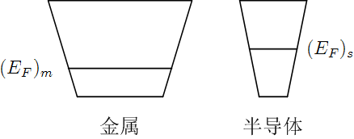

当金属与半导体**松散地**接触时，为了让两个系统的费米能级相等，半导体中的电子会向金属中流动，就好像半导体容器中的水向金属容器中流动一样，如下图所示：

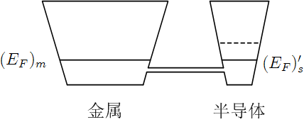

由于金属中电子有很多很多，半导体中流过来的电子对金属没有造成很大的影响，因此金属的费米能级近似不变，而整个半导体的费米能级却下降了。

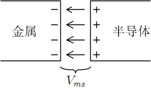

因为半导体中有电子向金属流动，所以金属表面出现负电荷，半导体表面出现正电荷，表面间隙间出现电场。上图即展示了这个过程。正是由于这个电场的存在，使得半导体的各个能级整体下移，直到费米能级和金属的对齐。因此电子从半导体表面通过电场到达金属表面所需的能量恰好是半导体费米能级降低的量$\Delta(E_F)_s$。这个电场在两个表面之间的电势差$V_{ms}$即为**接触电势差**。

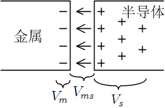

如上图，随着金属与半导体之间距离的进一步减小，金属表面处的负电荷密度越来越大，而半导体除了表面处有正电荷，表面附近体内也形成了一定的**空间电荷区**。这时接触电势包含三部分：$V_{ms}+V_s+V_m$，$V_s$叫做表面势，$V_m$由于很小一般忽略不计，最终当距离缩小为零时，$V_{ms}$其实也可以忽略了。这样一来，接触电势基本就只剩下$V_s$了。

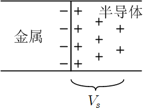

由上图可以看出，金属和半导体**紧密接触**的效果其实就两条：

1.  半导体的费米能级降至和金属相同。
2.  在半导体表面附近的空间电荷区形成一个电场。

关于费米能级前面已经讨论过，下面说说这个电场对半导体的影响。

把一个电子从半导体的内部移到半导体表面，电子需要克服电场力做功，因此说半导体表面处的电子能量普遍比内部的电子要高。我们由此可以推断出在半导体表面附近的能带要高于半导体内部的能带，即从内部到表面，能带要向上弯曲。

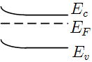

这个弯曲的程度即电子跨越接触电势差做的功：$qV_s$，也即为金属与半导体的费米能级之差：$(E_F)_s-(E_F)_m$，也即为功函数之差：$W_m-W_s$。

其实能带的弯曲与半导体表面附近电荷的正负是可以互相印证的。在半导体内部，$E_F$靠近$E_c$，根据前面有关费米能级的讨论，为N型半导体。在半导体表面，由于能带弯曲，$E_F$向$E_v$接近，变成P型半导体，也就是正电荷较多，与前面图片示意相符。

接下来我们看看其它几种情况是怎么样的。

|              | n型   | p型   |
| ------------ | ---- | ---- |
| $W_m\gt W_s$ | 阻挡层  | 反阻挡层 |
| $W_m<W_s$    | 反阻挡层 | 阻挡层  |

#### 问题

有一个问题无论如何也想不通。金属与半导体接触，会因为费米能级的不同而发生电子流动，最终的结果是使两者的费米能级相同。这里的相同指的可是整个半导体与整个金属啊。假设两者的真空能级都是一样的，那么半导体上的逸出功不就发生变化了吗？事实情况真的是这样的吗？

*其实半导体这边的真空能级是会下降的。整个过程可以这样来理解：费米能级不同导致电子流动 -> 在金属表面和半导体表面形成电场 -> 这个电场导致半导体的所有能级都下降，即真空中静止电子的能级也会下降*。

### 表面态对接触势垒的影响

接触势垒指的是当金属和半导体接触时（注意此时金属和半导体中的费米能级已经是相等了），金属一边的$$E_0 - (E_F)_m$$，即金属和半导体接触后，金属中的“功函数”。按道理讲，不同的金属和半导体接触，形成的共同费米能级不一样，那么接触势垒也就不一样了。但是经实验发现，不同的金属和半导体接触后，形成的接触势垒竟然都差不多。于是就进行进一步研究，认为是由半导体表面的**表面态**很大一部分决定了接触势垒的大小。

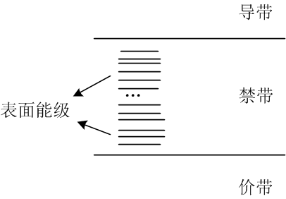

什么是半导体表面的表面态呢？在半导体的内部，所有电子都在允带里的分立能级上，禁带里是没有电子的。但是在半导体表面处，一些电子的能级落在禁带里，尤其是导带和允带中间那个禁带，这些能级叫做**表面能级**。正是由于禁带中表面能级的存在，才会使接触势垒稳定在一定的值处。这些电子所处的“态”就叫表面态。

表面态又分施主表面态和受主表面态两种。在半导体表面处，这两种表面态可以只存在一种，也可以两种共存。如何区分这两种表面态呢？在所有的表面能级中，有一个特殊的能级$q\phi_0$，高于这个能级的表面能级是受主型，低于这个能级的表面能级是施主型。$q\phi_0$一般位于大约禁带的三分之一处。如下图所示。

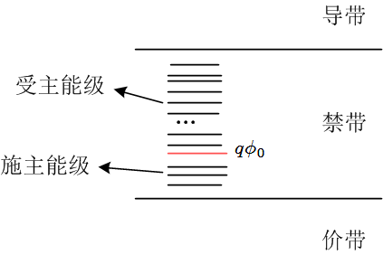

##金属半导体接触整流理论

**整流**指的是正向电流大，反向电流小。

外加电压后，半导体和金属不再处于相互平衡的状态，两者没有统一的费米能级。半导体内部费米能级和金属费米能级之差，等于由外加电压所引起的静电势能差。

下面先以n型半导体为例进行讨论。当n型半导体与金属接触时，表面处能带向上弯，对半导体内的电子来说形成势垒，这个势垒的高度为$-q(V_s)_0$，其中$(V_s)_0 \lt 0$，q指的是元电荷的电荷量。当对金属加上正的电压$V$时（电场方向由金属指向半导体），势垒变成$$-q[(V_s)_0+V]$$，其中$V \gt 0$，即正向电压。我们可以发现，这时势垒的高度是降低的，即向上弯的程度变小。这时动态平衡打破，形成从金属到半导体的正向电流。外加电压越高，势垒下降越多，正向电流越大。加反射电压（即$V\lt 0$时，势垒增高为$-\left[q[(V_s)_0+V\right]$，形成从半导体到金属的反向电流。金属一边的势垒不随外加电压变化，所以从金属到半导体的电子流是恒定的[^1]。外加电压增大时，势垒近一步增高，半导体到金属的这股电子流逐渐减小为零，反向电流趋近饱和。

对n型阻挡层的讨论类似，这时$(V_s)_0 \gt 0$。当$V \lt 0$（即金属加负电压）时，形成从半导体到金属到正向电流；当$V \gt 0$时，形成反向电流。

无论哪种阻挡层，正向电流都相应于多数载流子由半导体到金属所形成的电流。

注释：

[^1]: 怎样理解这句话呢？首先需要知道，金属与半导体之间电子的流动维持眷一个动态平衡，也就是说，总共有两股电子流。这句话指的是两股电子流中，从金属到半导体的这股。

### 扩散理论

*扩散理论用于定量描述金-半接触的伏安特性，适用于厚阻挡层。对应的材料为氧化亚铜。*

扩散理论假设势垒高度远大于$k_0T$，在势垒区，载流子全部耗尽，杂质全部电离，空间电荷完全由电离杂质的电荷形成。

设耗尽层的宽度为$x_d$，施主浓度为$N_D$，由泊松方程可以解出，当外加电压$V$于金属时，有

$$x_d = \left\{-\frac{2\varepsilon_r \varepsilon_0[(V_s)_0+V]}{qN_D}\right\}^{1/2}$$

由这个式子我们可以看出，势垒厚度与外加电压呈正相关。因此，如果外加电压增大，不仅势垒高度提高，宽度也会增大。

势垒厚度依赖于外加电压的势垒叫做**肖特基势垒**。

进而可以解出通过势垒的电流密度：$$J = J_{sD}\left[\exp\left(\frac{qV}{k_0T}\right)-1\right]$$

其中，$$J_{sD} = \sigma \left\{\frac{2qN_D}{\varepsilon_r \varepsilon_0} [V_D - V] \right\}^{1/2} \exp\left(-\frac{qV_D}{k_0T} \right)$$，$$\sigma = qn_0\mu_{no}$$

当$$V \gt 0$$，$$qV \gg k_0T$$，有$$J = J_{sD} \exp \left( \frac{qV}{k_0T} \right)$$

当$$V \lt 0$$，$$\left| qV \right| \gg k_0T$$，有$$J = -J_{sD}$$

这样就可以得到伏安特性曲线，如下图所示：

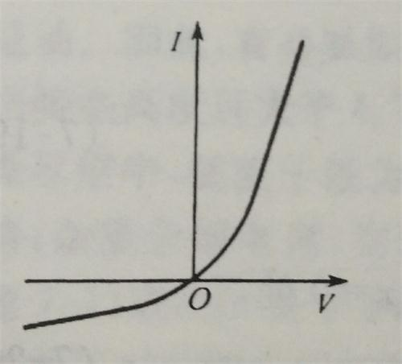

### 热电子发射理论

*热电子发射理论也是用来定量描述金-半接触的伏安特性，适用于薄阻挡层。典型的半导体材料有Ge、Si、GaAs。*

热电子发射理论假设n型阻挡层很薄，起决定作用的是势垒高度。所以电流的计算就归结为计算超越势垒的载流子数目。经推导可得：

$$J = J_{sT} \left[ \exp\left( \frac{qV}{k_0T}\right) - 1 \right]$$，其中$$J_{sT} = A^*T^2 \exp \left( - \frac{q\phi_{ns}}{k_0T}\right)$$，$A^*$为有效理查逊常数。

$J_{sT}$与外加电压无关，但却是一个更强烈地依赖于温度的函数。

### 镜像力和隧道效应的影响

 #### 镜像力

在半导体表面附近的的电子或空穴会在金属表面附近感应出来相反的电荷，这些感应电荷又反过来对半导体的能带结构造成影响。感应出来的电荷就叫做**镜像电荷**，感应电荷与原电荷之间的吸引力叫**镜像力**。

经过分析，可得镜像力使得势垒降低了$$q\Delta\phi = \frac 1 4 \left[\frac{2q^7N_D}{\pi^2\varepsilon_r^3\varepsilon_0^3} (V_D-V) \right]^{1/4}$$

可以看出，镜像力所引起的势垒降低量随反向电压的增加而缓慢地增大。

于是我们可以得到如下的修正势垒图示意图：

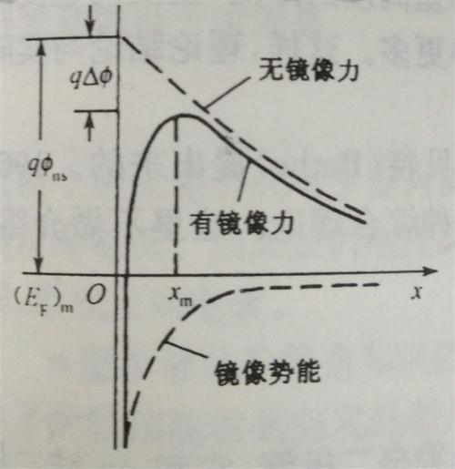

其中，加上镜像力的作用后，电势能最大值所在位置$$x_m = \frac 1 {4(\pi N_Dx_{d0})^{1/2}}$$。这个极大值发生在作用于电子上的镜像力和电场力相平衡的地方。

#### 隧道效应

隧道效应指的是能量低于势垒顶的电子有一定概率穿过这个势垒，穿透的概率与电子能量和势垒厚度有关。

将隧道效应应用到整流理论上时，我们做这样的简化假设：对于一定能量的电子，存在一个临界势垒厚度$x_c$，若势垒厚度大于$x_c$，则电子完全不能穿过势垒；如果势垒厚度小于$x_c$，则电子可以直接通过它。

经分析得隧道效应引起的势垒降低是$$\left[ \frac{2q^3N_D}{\varepsilon_r\varepsilon_0}(V_D-V)\right]^{1/2}x_c$$，它也随反向电压增加而增大。当反向电压较高时，势垒的降低才较明显。

### 肖特基势垒二极管

## 少数载流子的注入和欧姆接触

### 少数载流子的注入

### 欧姆接触

