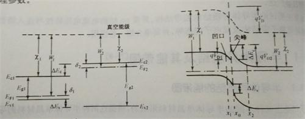

# 第九章 半导体异质结构

**同质结**指的是由导电类型相反的*同一种*半导体单晶材料。前面讨论的pn结就是一种同质结。

**异质结**指的是由*两种不同的*半导体单晶材料组成的结。

## 半导体异质结及其能带图

### 半导体异质结的能带图

从导电类型上分，可以将异质结分为反型异质结和同形异质结。**反型异质结**指的是*导电类型相反*的两种不同的半导体单晶材料所形成的异质结。例如由p型Ge与n型GaAs形成的结，记为p-nGe-GaAs，或(p)Ge-(n)GaAs。**同型异质结**指的是*导电类型相同*的两种不同的半导体单晶材料所形成的异质结。如n-nGe-GaAs，或(n)Ge-(n)GaAs、

一般把禁带宽度较小的半导体材料写在前面。

异质结的能带图取决于四个方面：

1.  界面态
2.  两种半导体的电子亲和能
3.  禁带宽度
4.  功函数

我们通常研究的是突变异质结。

####反型异质结

在左侧的图中，左边是p型半导体的能带，右边是n型半导体的能带。右侧图是接触后的能带图。

用金-半接触同样的分析方法，可知内建电场的电势满足$$V_D = qV_{D1} + qV_{D2} = E_{F2} - E_{F1}$$，$$V_D = V_{D_1} + V_{D_2}$$。

突变反型异质结构的能带图有两个特点：

1.  能带发生了弯曲。

    p型半导体向下弯了$qV_{D1}$，形成“凹口”，n型半导体向上弯了$qV_{D2}$，形成“尖峰”。

2.  能带在交界面处不连续，有一个突变。

    设导带底的突变为$\Delta E_c$，又叫**导带阶**。价带顶的突变为$\Delta E_v$。又叫**价带阶**。有$\Delta E_c = \chi_1 - \chi_2$，且有$\Delta E_c + \Delta E_v = E_{g2} - E_{g1}$。

#### 同型异质结

对于反型异质结，两种半导体材料的交界面两边都成为耗尽层，而在同型异质结中，一般必有一边成为积累层。

上图为nn异质结的平衡能带图。

界面态也会对异质结的能带结构产生影响。引入界面态的原因是：形成异质结的两种半导体材料的晶格失配。

对于晶格常数为$a_1$及$a_2$，且$a_1 \lt a_2$的两种半导体材料之间的晶格失配定义为$2(a_2 - a_1)/(a_1 + a_2)$。

由于晶格失配，在两种半导体材料的交界面处产生了悬挂键，引入了界面态。

## 半导体异质pn结的电流电压特性及注入特性

## 半导体异质结量子阱结构及其电子能态与特性

## 半导体应变异质结构

