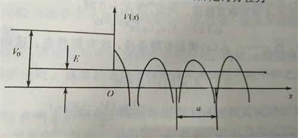

# 第8章 半导体表面与MIS结构

半导体表面的重要性：

1.  实际的材料都有表面，所以研究表面特性必不可少。
2.  表面特性形成的表面态会与体内交换电子或空穴。
3.  表面态对晶体管和半导体集成电路的参数和稳定性有很大影响。
4.  很多情况下，特别是平面化工艺，往往不是半导体的体内效应，而是半导体的表面效应决定器件的效应。MOS。
5.  从整体的角度，半导体的表面实际上可以看作是漏电很小的元器件。

## 表面态

### 板书

*   表面态的种类

    1.  达姆表面态（由悬挂键形成）
    2.  晶格缺陷表面态（由缺陷形成）
    3.  吸附原子表面态（由吸附原子形成）

    这三种表面态都是共同存在的。

*   工艺中的几种氧化层

    | 氧化层名称   | 厚度            | 作用        |
    | ------- | ------------- | --------- |
    | 原生氧化层   | 15~20 A       | 去掉        |
    | 屏蔽氧化层   | ~200 A        | 离子注入遮蔽层   |
    | 遮蔽氧化层   | ~5000 A       | 扩散        |
    | 场区局部氧化层 | 3000 ~ 5000 A | 绝缘  locos |
    | 垫底氧化层   | 100 ~ 200 A   | 硅应力缓冲     |
    | 牺牲氧化层   | <1000 A       | 去掉缺陷      |
    | 栅极氧化层   | ~             |           |
    | 阻挡氧化层   | 100 ~ 200 A   | 浅槽隔离  STI |

### 达姆表面能级

达姆表面能级指的是*晶体自由表面的存在使其周期场在表面处发生中断，从而产生的附加能级*，简单地说就是纯净的晶体在表面处的能级。

为了简化问题，我们假设晶体表面处的电子处在一个半无限的周期势场中，如下：

其中，x\<0的部分指的是表面外，x\>0的部分指的是半导体表面内的区域。

有了势场，我们就可以列出薛定谔方程：

$$\frac{-\hbar^2}{2m_0}\frac{d^2\psi}{dx^2}+V_0\psi = E\psi\ (x\leqslant 0)$$

$$\frac{-\hbar^2}{2m_0}\frac{d^2\psi}{dx^2}+V(x)\psi = E\psi\ (x\geqslant 0)$$

其中，周期势能函数$V(x)$满足$$V(x+a) = V(x)$$。

通过解这两个薛定谔方程，可以得到

$$\psi_1 (x) = A\exp(\frac{(2m_0(V_0-E))^{\frac 1 2}}{\hbar}x) \ (x\leqslant 0)$$

$$\psi_2(x) = A_1u_k(x)e^{ik'x}e^{-k''x}\ (x\geqslant 0)$$

也就是说**在$x=0$两边，波函数都是按指数关系衰减**，因此电子就被局限在表面附近。这时电子的状态叫**表面态**，对应的能级叫**表面能级**。每个表面原子都在禁带中对应着一个表面能级，因此表面能级其实密度是很高的。这些表面能级大致可以分为两类：施主能级和受主能级。其中靠近价带的能级叫做施主能级，靠近导带的能级叫受主能级。需要注意的是，这个顺序和掺杂引入的能级正好相反。对于掺杂能级，靠近价带的能级叫受主能级，靠近导带的叫施主能级。

*怎么来记这个顺序呢？可以用这种方法联合：1. 对于一个本征半导体，下面是价带，上面是导带，价带顶有空穴，导带底有电子 -> 2. 施主能级施的是电子，没了电子就只剩空穴，空穴和空穴放一起，因此靠近空穴的表面能级是施主能级；受主能级受的也是电子，电子和电子放一起，因此靠近导带的表面能级是受主能级 -> 3. 掺杂引入的能级的顺序和表面能级刚好相反。*

用化学键的方式描述，其实就是因为半导体表面那一层原子中，只有三个键形成了共价键，还有一个键成了**悬挂键**，与这些悬挂键对应的电子能态就是表面态。由于悬挂键的存在，表面可与体内交换电子和空穴。对于n型硅，悬挂键可以从体内获得电子，使表面带负电，这些负的表面电荷可排斥表面层中电子使之成为耗尽层甚至成为p型反型层。

## 表面电场效应

**板书**

要求
1.  为什么要研究材料的表面电场效应
2.  半导体表面层内产生电场的原因
    1.  金-半之间有功函数之差
    2.  表面态（半导体表面外吸附某种带电离子）
    3.  上述情况1，2都有
    4.  外加电压
3.  理想MIS满足的条件
    1.  金属与半导体间功函数差为零。
    2.  在绝缘层内没有任何电荷且绝缘层完全不导电。
    3.  绝缘体与半导体界面处不存在任何界面态。

**课本内容**

之所以提出MIS结构，又假设MIS结构是理想的，就是为了研究金属与半导体接触时，外加电压的影响。这样由研究外加电压得到的结论可以扩展到由功函数不同产生的电压，由吸附离子而产生的电压上等。

MIS结构的本质是一个电容，加上电压后，产生的电场被分割成三份，一份落在金属表面极薄的一层内（可以看作一个原子的厚度），一份落在绝缘层上，还有一份落在半导体表面附近比较厚的一层内。如下图所示：

[图1]

至于金属和绝缘层内的电场我们不是很关心，我们比较关心的是半导体内的电场是如何影响载流子的。半导体表面附近的电场所在区域称作**空间电荷区**，表面与体内的电势差称为**表面势$V_s$**，规定电场方向由外向里为正方向。

对于p型半导体，$V_s\lt0$时，表面处空穴堆积；$V_s>0$时，表面处空穴浓度降低很多，称作耗尽；$V_s \gg 0$时，表面处电子浓度超过空穴浓度，形成反型层。这个结论可以这样记：$V_s \lt 0$时，想象电场线方向从内指向表面，又因为是p型半导体，所以空穴朝表面运动，出现堆积。而$V_s \gt 0$时，电场线由表面指向体内，表面处的空穴朝半导体体内运动，表面呈耗尽状态。当$V_s \gg 0$时，表面处的空穴几乎都到体内，因此表面处电子开始占多数，形成反型层。（这只是个形象的解释，真正的解释还是需要用书上的能带理论）。