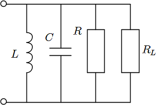
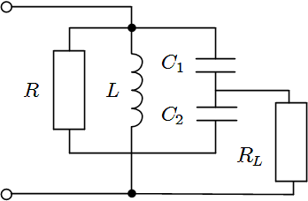

# 第二章

## 2.1

这道题假设我们已经知道了收音机的负载回路是这样的：

 第一问考查了两个公式：

$$W_{0.7} = \frac {f_0}{Q_L}$$

$$\omega_0 = \frac 1 {\sqrt {L C}}$$

其实在书上19页例2-1对第二个公式做了优化：

当$f_0$以MHz为单位，C以pF为单位，L以μH单位时，并联谐振回路中电感的计算公式为$$L = \frac{25330}{f_0^2\cdot C}$$ 。

这样一来，我们可以直接将题目中的数据代入式子，求得电感。

第二问其实考查了这两个公式：

在并联谐振回路中，$$Q_0 = \omega_0 C R$$，$$Q_L = \omega_0 C R_总$$。其中$R$指的是回路原本就带有的等效电阻，而$R_总$指的是回路总的并联电阻，即$$\frac 1 R_总 = \frac 1 R + \frac 1 R_L$$ 。

由$Q_0$，可以推出$R$；由$Q_L$，可以推出$R_总$。再由并联关系，就可以得到$R_L$的值了，即第二问的答案。

于是这道题的解题过程如下：

$$B_{0.7} = \frac {f_0}{Q_L} \Rightarrow Q_L = \frac {f_0}{B_0.7} = 58.125$$

$$L = \frac {25330}{f_0^2 C} = 585.73 \ \mu H$$

$$Q_L = \omega_0 C R_总 \Rightarrow R_总 = 99.47 \ k\Omega$$

$$Q_0 = \omega C R \Rightarrow R = 120.55 \ k\Omega$$

$$\frac 1 {R_总} = \frac 1 R + \frac 1 {R_L} \Rightarrow R_L = 238.67 \ k\Omega$$

## 2.3

这道题的图中并没有画出并联谐振回路中的电阻$R$，但是不能认为没有。因此，实际的电路图应该是这样的：

设$C$为并联谐振回路的总电容，则有

$$\frac 1 C = \frac 1 {C_1} + \frac 1 {C_2} \Rightarrow C = 80 \ pF$$

$$L = \frac {25330}{f_0^2 C} \Rightarrow L = 316.625 \ uH$$

设$R$为回路原有的电阻，有

$$Q_0 = \omega_0 C R \Rightarrow R = 198.94 \ k\Omega$$

设$R_L'$为$R_l$经折算后的电阻，有

$$p = \frac {C_1}{C_1 + C_2} \Rightarrow p = 0.8$$

电阻的折算方法是除以p^2，所以$$R_L' = \frac {R_L}{p^2} \Rightarrow R_L' = 3.125 \ k\Omega$$

$$\frac 1 {R_并} = \frac 1 R + \frac 1 {R_L'} \Rightarrow R_并 = 3.08 \ k\Omega$$

$$Q_L = \omega_0 R_并 C \Rightarrow Q_L = 1.55$$

虽然算出来$Q_L$为1.55，但是实际上$Q_L$不可能这么低。事实上，题中$C_1$和$C_2$的值写反了。更正后，算得$Q_L = 20.09$。

# 第三章

#第五章

##5.4

这道题与前面讲的二极管平衡电路唯一的不同点为输入电压$u_1$和控制电压$u_2$互换了位置。这样带来的影响有两个：

1.  $g_1 \ne g_2$。这是因为控制电压$u_2$被放到了左边，而$u_1$太小，无法控制二极管的通断。
2.  $u_{D2} = u_1 - u_2$。在原来的二极管平衡电路中，$u_{D2} = u_2 - u_1$，但是在这道题中需要把$u_1$和$u_2$换个位置。

用同样的方法分析这道题，得到：

$$i_1 = g_1(t)u_{D1} = g_DK(\omega_2 t)(u_1+u_2)$$，

$$i_2 = g_2(t) u_{D2} = g_DK(\omega_2 t - \pi) (u_1 - u_2)$$

假设两个变压器的匝数比都是1，则有$i_{L1} = i_1$，$i_{L2} = i_2$。

因此负载上的电流

$$\begin{align}i_L &= i_{L1} - i_{L2} \\ &= i_1 - i_2 \\ &= g_D  K(\omega_2) (u_1+u_2) - g_DK(\omega_2 t - \pi) (u_1 - u_2) \\ &= g_D \left\{ \left[ K(\omega_2 t) - K(\omega_2t - \pi) \right] u_1 + \left[ K(\omega_2 t) + K(\omega_2 t - \pi) \right] u_2 \right\} \end{align}$$

因为$$K(\omega_2 t) - K(\omega_2 t - \pi) = K'(\omega_2 t)$$，$$K(\omega_2 t) + K(\omega_2 t - \pi) = 1$$，因此

$$i_L = g_D (K'(\omega_2 t) + u_2)$$

又因为将$$K'(\omega_2 t)$$用泰勒展开后为[^1]

$$K'(\omega_2 t) = \frac 4 \pi \cos \omega_2 t - \frac 4 {3\pi} \cos 3 \omega_2 t + \frac 4 {5\pi} \cos 5 \omega_2 t + \cdots \\ + (-1)^{n+1} \frac 4 {(2n+1) \pi} \cos (2n+1) \omega_2 t + \cdots$$

所以$$i_L = g_D[(\frac 4 \pi \cos \omega_2 t - \frac 4 {3\pi} \cos 3 \omega_2 t + \frac 4 {5\pi} \cos 5 \omega_2 t + \cdots)U_1 \cos \omega_1 t + U_2 \cos \omega_2 t]$$

$$u_o (t) = i_L R_L$$

与153页的式（5 - 44）相比，少了$\omega_1$分量，多了$\omega_2$分量，其它频率分量的振幅是后者的两倍。

##5-5

分析方法同上一题，

$$u_{D1} =  u_{D2} = u_1 + u_2$$

$$i_1 = g_1(t)u_{D1} = g_D K(\omega_2 t) (u_1 + u_2)$$，$$i_2 = g_2(t)u_{D2} = g_D K(\omega_2 t - \pi)(u_1+u_2)$$

$$\begin{align}i_L &= i_1 - i_2 \\ &= g_D (u_1 + u_2) (K(\omega_2 t) - K(\omega_2 t - \pi)) \\ &= g_D(u_1 + u_2)K'(\omega_2 t) \\ &= g_D(U_1 \cos \omega_1 t + U_2 \cos \omega_2 t) ( \frac 4 \pi \cos \omega_2 t - \frac 4 {3\pi} \cos 3\omega_2 t + \cdots) \end{align}$$

接着利用积化和差公式，可以分析出$i_L$中的频率分量为$(2n + 1) \omega_2 \pm \omega_1$，$2n \omega_2$，其中$n = 0, 1, 2, \cdots$。与153页的式子相比，少了$\omega_1$分量，多了$2n\omega_2$分量。

## 5-9

由时变跨导$g_m(t)$的定义[^2]可得，

$$g_m(t) = \frac {di_D} {du_{GS}} = - \frac {2I_{DSS}} {V_p} (1 - \frac {u_{GS}} {V_p})$$

当$u_{GS} = 0$时，有$$g_{m0} = - \frac {2 I_{DSS}}{V_p}$$，（$V_p \lt 0$ ）

当$u_{GS} = E_{GS} + u_2$时，有$$g_m(t) = - \frac {2I_{DSS}} {V_p} (1 - \frac{E_{GS}} {V_p}) + \frac {2I_{DSS}} {V_p} \cdot \frac {u_2} {V_p}$$

将$g_{m0}$代入，得$$g_m(t) = g_{m0} (1 - \frac {E_{GS}}{V_p}) - g_{m0} \frac {u_2} {V_p}$$

当$u_2 = U_2 \cos \omega_2 t$，$E_{GS} = V_p / 2$时，$$g_m(t) = \frac 1 2 g_{m0} - g_{m0} \frac {U_2}{V_p} \cos \omega_2 t$$

由此可知，$$g_{m1} = g_{m0} \frac {U_2}{|V_p|}$$，静态工作点跨导$$g_{mQ} = \frac 1 2 g_{m0}$$

当$U_2 = |V_p - E_{GS}|​$，$E_{GS} = V_p / 2​$时，由上式得$$g_{m1} = \frac 1 2 g_{m0}​$$

因此$g_{m1}$为静态工作点跨导。

## 注释

[^1]: 这个展开式在书上156页
[^2]: 原始定义在书上148页，$g(t) = f'(E_Q + U_2 \cos \omega_2 t)$。在场效应管的频谱搬移电路那一节，这个字母多加了一个m，不知道这个m是什么意思。但是定义和原来基本相同，即$$g_m = \frac {d i_D} {du_{GS}}$$。

 