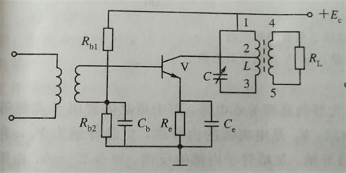
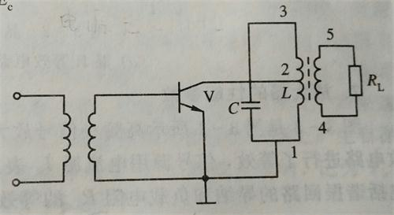
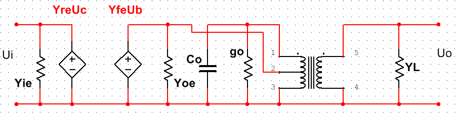
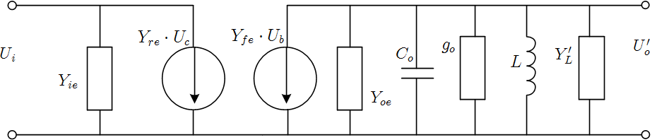
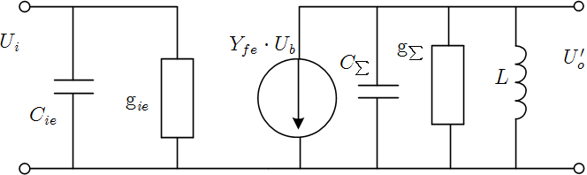
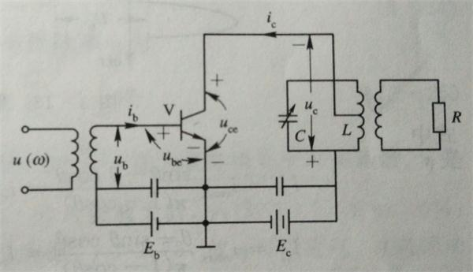
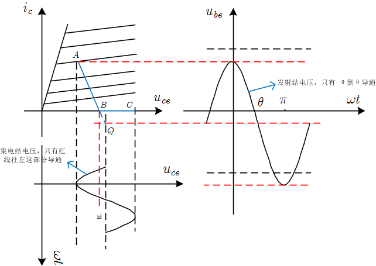
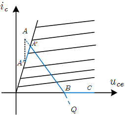

# 高频谐振放大器

*高频谐振放大器与之前学的低频放大器最大的不同是，高频谐振放大器以谐振回路作为负载。*

## 高频小信号放大器

通常我们根据负载的类型对高频小信号放大器进行分类。如果负载为抽头谐振回路（单调谐回路），那么放大器为*单调谐放大器*。如果负载为耦合振荡回路（双调谐回路），那么放大器为*双调谐放大器*。如果负载为多调谐回路，则称放大器为*多调谐放大器*。

### 单调谐放大器

单调谐放大器的电路图如图所示：

这是一个典型的共发射极高频放大器，以抽头谐振回路作为负载，因此叫做单调谐放大器。注意这里的电感L除了是抽头谐振回路的一部分，也是抽头变压器的一部分。

为了分析其交流性能，我们画出它的交流等效电路：

在高频放大器中，交流等效电路的画法是：**所有偏置电阻清零，旁路电容都作为通路对待，电源是交流地**。

但是仅画成这样还不够，还需要对晶体管作处理。通常我们用晶体管的Y参数等效电路来分析其性能。

设抽头回路的接入系数$$p_1 = \frac{L_{12}}{L_{13}}$$，抽头变压器的接入系数$$p_2=\frac{N_{45}}{N_{13}}$$。方便后面推导公式用。

下面是经过进一步简化的电路：

我们可以看到，右边的$C_o$，$g_o$，$L$及负载$Y'_L$构成了一个简单并联谐振回路，实际上这个电路还可以继续化简。

我们假设这个电路是单向的（$Y_{re}=0$），令$$Y_{ie} = g_{_ie} + C_{ie}$$，最终可以得到这样的电路图：

其中，$$\text g_{\Sigma} = \text g_o + p_1^2\text g_{oe} + p_2^2\text g_{ie}$$，$$C_{\Sigma} = C_o + p_1^2C_{oe} + p_2^2C_{ie}$$。$p_1$，$p_2$是前面定义过的两个接入系数。

#### 性能分析

*   电压增益

    $$A_u = \frac{U_o}{U_i} = -\frac{p_1p_2Y_{fe}}{\text g_{\Sigma}(1+j\xi)}$$

    $$A_{u0} = \frac {p_1p_2\left|Y_{fe}\right|}{\text g_{\Sigma}} = \frac {p_1p_2\left|Y_{fe}\right|}{\text g_o + p_1^2\text g_{oe} + p_2^2\text g_{ie}}$$

    结论：

    1.  增益与$\left|Y_{fe}\right|$成正比，与$\text g_{\Sigma}$成反比。

    2.  增益与带宽是一对矛盾。

        $$A_u\uparrow\ \Rightarrow\ \text g_\Sigma \downarrow \ \Rightarrow \ Q_L\uparrow \ \Rightarrow \ BW_{0.7} \downarrow $$

        其中，$$Q_L = \frac {\omega_0 C_\Sigma}{\text g_\Sigma}$$，$$BW_{0.7} = \frac {f_0} {Q_L}$$

* 通频带

  通频带：$$BW_{0.7} = \frac {f_0} {Q_L}$$

  增益带宽积：$$A_{u0}\cdot BW_{0.7} = \frac {p_1p_2\left|Y_{fe}\right|}{2\pi C_\Sigma}$$

**问题**

**为什么说电路一定时，增益带宽积是一个定值？电路一定时，难道增益不是个定值吗？**

*   选择性

    矩形系数$$K_{r0.1} = 9.96 \gg 1$$，因此单调谐放大器的选择性较差。

*   功率增益

    功率增益$$A_{p0} = \frac{\left|Y_{fe}\right|^2}{4\text g_{oe}\cdot \text g_{ie}} \cdot \frac {4q} {(1+q)^2} \cdot \left(1-\frac{Q_L}{Q_0} \right)^2$$

    其中，$$q = \frac {\text g'_{ie}}{\text g'_{oe}}$$

    一些简单的结论：

    1.  当$$Q_0\to \infty$$，$$q = 1$$（即$$\text g_{ie} = \text g_{oe}$$）时，功率增益有最大值$$A_{p0max} = \frac {\left|Y_{fe}\right|^2}{4\text g_{ie}\cdot \text g_{oe}}$$

### 双调谐放大器

双调谐放大器与单调谐放大器最大的不同点就是，双调谐放大器采用耦合谐振回路作为负载。

####性能分析

*   电压增益

    $$A_{u0max} = \frac {\text y_{fe}}{2\text g_{ie}\text g_{oe}}$$

*   功率增益

*   通频带

*   选择性

    $$K_{r0.1} = \sqrt[4]{10^2-1} = 3.15$$

    可以看出，双调谐回路的选择性要比单调谐回路好。

#### 特点

1.  在临界耦合且回路损耗为零、负载匹配时。
    1.  电压增益，功率增益都为最大且与单调谐 放大器一致。
    2.  通频带是单调谐放大器的$$\sqrt 2$$倍 。
    3.  矩形系数比单调谐放大器的小，选择性好。
2.  强耦合时：谐振曲线顶部凹陷、调整困难、 通频带加宽、矩形系数好。
3.  弱耦合时：通带窄、增益低、矩形系数差。 

### 参差调谐放大器

### 多级放大器

为了增大电压增益，增强稳定性等，有时候需要将多个放大器级联起来。在多级放大器中为了满足总的带宽的要求，单级带宽必须向应加宽，级数增加到一定程度，在满足总带宽的要求下，总增益将下降。

#### 多级单调谐放大器

#### 多级双调谐放大器

### 稳定性分析

#### 中和法

#### 失配法

## 高频功率放大器

*高频功率放大器最主要的特点有两个：一，工作在高频状态，以谐振回路作为负载；二，处于大信号非线性状态。*

上图是高频功率放大器的原理图。要注意呀，这个图里面有个$u_c$，下标c的含义虽然不清楚是什么，但是要记住的是$u_c$就是$u_o$，并且这个$u_c$的负极是不接地的。在输出回中，有一个关系式一定要弄明白：$$E_c = u_c + u_ce$$，也就是说电源电压被三极管和输出负载分摊了，三极管上少分点压，输出负载上就会多一些电压，好像“电源的效率提高了”。

*有个问题：书上说静态时发射结要反偏，为啥这里的发射结看上去没有反偏？*

这个问题已经知道答案了，因为三极管的开启电压大约为0.7V，并且我们要保证导通角大约在$70^\circ$左右，这样一来，我们只需要正向提供0.3V或0.4V就可以了，此时发射结仍未被导通。具体要不要反偏，得看设置的导通角是多少。如果导通角更小一些，说不定就真的要反偏才能满足要求了。另外，在实际的电路中，一般采用自偏压电路，$E_b$其实是不会出现的。

### 评价指标

为了评价高频功率放大器的性能，这里有一些默认的评价指标。

设电源的电压为$E_c$，集电极电压为$U_c$，集电极上的电流为$i_c$，下标0表示直流分量，1表示基波分量，2表示二次谐波分量。

*   电压利用系数 $\xi$

    $$\xi = \frac{U_c}{E_c}$$

*   电流利用系数(波形系数) $\gamma$

    $$\gamma = \frac {I_{c1}}{I_{c0}}$$

*   集电极效率 $\eta_c$

    $$\eta_c = \frac 1 2 \xi \cdot \gamma$$

### 导通角对电压、电流的影响

若导通角为$\theta_c$，那么集电极的交变电流$$i_c = I_M \cos \omega t - I_M \cos \theta_c$$，其中$I_M$为假想中补齐了的放大后信号的振幅。当$\cos \omega t = 1$时，有$$i_{cmax} = I_M - I_M \cos \theta_c$$，将这个式子代入第一个式子，我们便得到了$i_c$关于$\theta_c$的表达式：

$$i_c = i_{cmax} \frac {\cos \omega t - \cos \theta_c} {1 - \cos \theta_c}$$

示意图片1

### 分解系数与最佳导通角的确定

*导通角的变化本质上是影响了频谱线的分布。经过功率放大器放大后的信号可以通过低通滤波器将基波信号取出来。*

一般情况下，我们只分析直流、基波和二次谐波这三个主要分量：

$$\begin{align} i_c  &= I_{c0} + I_{c1}\cos \omega t + I_{c2} \cos 2\omega t + \cdots \\ &= i_{cmax} \alpha_0(\theta_c) + i_{cmax}\alpha_1 (\theta_c) + i_{cmax}\alpha_2(\theta_c) + \cdots\end{align}$$

于是我们可以画出各项的系数随导通角的变化曲线，如上图所示。若只考虑$$\gamma = \frac {I_{c1}}{I_{c0}}$$，则当$\theta_c = 120^\circ$时有最大值。但是综合考虑到$$\eta = \frac 1 2  \xi \cdot \gamma$$，选择$\theta_c$在$60^\circ \sim 80^\circ$时最好。

### 放大器动态特性分析

高频放大器的动态特性指的是当接上激励信号与负载阻抗后的，晶体管电流与电压的关系。这组关系隐含在下面这组方程里：
$$
\begin{cases}
u_{be} = E_b + U_b\cos \omega t \\
u_{ce}  = E_c - U_c\cos \omega t \\
i_c = g_c (i_{be} - U_j)
\end{cases}
$$
其中$g_c$为转移导纳，$U_j$为开启电压。

虽然这组关系可以说明问题，但是不够直观。因此我们常在晶体管的输出特性曲线里画出接上负载后$u_{ce}$与$i_c$的关系以便直观地分析。

在低频放大器中，这个关系是一条直线。在高频放大器中，这个关系可近似看成一段折线。

我们只知道$$u_{be} = E_b + u_b$$，$$u_{ce} = E_c - u_c$$。要注意呀，这里的$u_b$和$u_c$都是交流分量。其值随相位的不同而不同。当相位$\omega t = 0$时，$$u_{be} = E_b+U_b$$，$$u_{ce} = E_c - U_c$$；当$\omega t = \pi /2$时，有$u_{be} = E_b$，$u_{ce} = E_c$；而当$\omega t = \pi$时，$u_{be} = E_b - U_b$，$u_{ce} = E_c + U_c$。这样使可以在三极管的输出特性曲线上得到三个点，将这三个点连接，便可以得到高频放大器的动态特性曲线。

为了进一步简化分析，我们将晶体管的输出特性曲线也近似地看成几段直线。于是就可以得到如下的图：

这张图该怎么看懂呢？

首先看左上角这幅图。这幅图指的是三极管的输出特性曲线，并且做了一个简化处理，把原来的曲线都画成了直线，至于图上的A、B、C点及Q点先不要去管。

接下来看右边那张图。右边那张图指的是三极管的发射极电压随时间的变化，首先我们应该注意到，整个余弦曲线的平衡位置稍向下靠了点，$u_{be}\gt 0$的部分都是在$(-\theta,\theta)$的范围内，说明导通角为$\theta$。中间那条红虚线向左延伸，在左图中交黑虚线于Q点，指的是当发射结没有外加信号时的状态，但其实$i_c$不可能为负值，因此静止工作点Q点是个虚拟的点，而不是一个真实的工作状态。最上面的那条红线指的是发射集电压的的最大值，即输入信号的最大值减去发射极的偏置电压，往左延伸交左图中的线于A点，A点即为输入信号最大时，三极管的工作状态。最下面那条红线不重要。

由已经介绍的两幅图，我们可以得到A点和Q点，连接这两个点交$u_{ce}$轴于B点，这是当管子要截止时的输出状态。

最后看左下角那幅图，这幅图是三极管$u_{ce}$随时间的变化曲线，顺时针旋转90度后得到的图像。可以看出，整个正弦曲线都在$u_{ce} \gt 0$的地方，而不是像右上角那幅图那样，有的部分大于零，有的部分小于零。这是因为需要保证晶体三极管工作在放大区。这幅图中所对应的红线即为B点所对应的$u_{ce}$。由前面我们知道B点是三极管截止时的一个点，因此在这幅图中，只有红线往左的曲线是正常的输出信号，而红线往右的输出信号其实是不存在的。

我们回过头再来看一个左上角那个图，A点对应的是输入信号最大时三极管的工作状态，B点对应的是输入信号在导通角范围之外时三极管的截止点，C点对应的是截止状态的极限值。整个AB段对应的是输入信号在导通角$\theta$之内，而BC段指的是输入信号在导通角$\theta$之外。

#### 欠压状态

上面那幅图画的状态即为欠压状态。欠压状态指的是A点在临界线右边，输出电压的幅度还有可以增大的空间。

#### 过压状态

过压状态是指A点落在临界线的右边。

这时会发生什么呢？由于A在临界线右边，所以说A其实是一个想象中的状态，并不是实际存在的。设直线AB交临界线与点$A''$，从A点向下作垂线交临界线与点$A'$。此时折线段$A' \rightarrow A'' \rightarrow B \rightarrow C$是交流负载线。当输入信号达到$A''$时，输出信号的电流有最大值，但是当输入信号继续增大时，三极管上的分压$u_{ce}$进一步减小，因此输出信号的电压会继续增大，但此时输出信号的电流却开始减小了。输出信号的电压和电流分别如下图所示：

#### 临界状态

临界状态是一种比较理想的状态，A点正好处在临界线上，此时集电极的利用效率最高。电压与电流的图像类似于欠压状态。

### 高频功放中的计算

