# 高频电路基础与系统问题

高频电路中的两个基础问题，一个是选频（窄带滤波），另外一个是阻抗匹配。

阻抗匹配的主要作用是提高电路的传输效率。当下一级电路的输入阻抗等于上一级电路的输出阻抗，或者当电路的负载电阻等于电路的信号内阻时，电路的传输效率最高。因此我们需要一个阻抗匹配的过程来解决这个问题。

下面一张表格介绍了一些常用电路及其所对应的功能：

| 电路名称          | 主要功能      |
| ------------- | --------- |
| 简单谐振回路        | 选频        |
| 抽头并联谐振回路      | 选频、阻抗变换   |
| 耦合谐振回路（双调谐回路） | 窄带滤波，阻抗变换 |
| 高频变压器         | 阻抗变换      |
| 传输线变压器        | 宽频带阻抗变换   |
| LC网络          | 阻抗变换、选频   |

## 简单谐振回路

常用的简单高频振荡回路有两种，一种是串联谐振回路，另外一种是并联谐振回路。这两种电路的特别之处就在于，它们的阻抗模值随频率的变化而变化，而且有一个极小值（串联谐振回路）或极大值（并联谐振回路）。当模值变化到极值点时，对应的角频率值就是谐振角频率$\omega_0$。$\omega_0$的另一种等价定义是使感抗与容抗相等的角频率。

有一个细节需要注意：角频率与频率不同，换算关系为$$\omega=2\pi f$$。

在以下介绍的三种振荡回路中，最重要的是**并联谐振回路**，其它两个可以略过不看。

关于这些电路之间的逻辑关系及参数的计算方法，我觉得书上讲的有点乱。详情可以参考这篇论文：

[谐振电路中品质因数的计算方法](https://wenku.baidu.com/view/28d16804e87101f69e31959d.html)

为了理清来龙去脉，下面的介绍都没有完全按照书上的思路。

### 串联谐振回路

串联谐振回路的电路图：

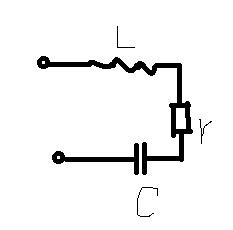

#### 阻抗分析

$$Z = r + \frac 1 {j\omega C} + j\omega L=r+j(\omega L - \frac 1 {\omega C})$$

$Z$的第一个式子是原始计算式，第二个式子把化简成了实部和虚部两部分。

其模值$$\left|Z\right|=\sqrt{r^2+(\omega L-\frac 1 {\omega C})^2}=\sqrt{r^2-2\frac L C + \omega^2L^2+\frac 1 {\omega^2C^2}}$$

可以定性分析出来，模值随着频率的增大而先减小后增大。

在matlab里做一下验证：

假设$L = 1\times 10^{-4}, C=5\times 10^{-4}, r = 2\times 10^4$，可以画出其阻抗的模值随频率的变化图如下：

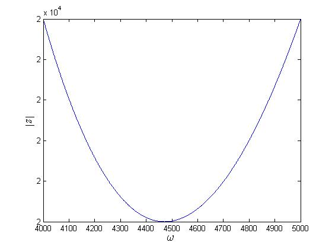


为了找到极值点的位置，可以设$$f(\omega) = (\omega L - \frac 1 {\omega C})^2$$，

求导得到$$f'(\omega) = 2(\omega L - \frac 1 {\omega C})(L+\frac 1 {C\omega^2})$$，

令其等于零$$f'(\omega) = 0$$可以解得$$\omega = \frac 1 {\sqrt {LC}}$$

将$L = 1\times 10^{-4}, C=5\times 10^{-4}$代入得$\omega \approx 4472$，刚好是图像中最低点的位置。

matlab 代码如下：

```matlab
clear, clc

syms r omega L C real
Z = r + i * (omega * L - 1/(omega * C));
modulus = abs (Z);
f = subs (modulus, [L, C, r], [1*10^(-4), 5*10^(-4), 2*10^4]);

start = 4000;
over = 5000;
range  = (start:(over-start)/1000:over);
range (range == 0) = [];
impedance_modulus = subs (f, omega, range);
impedance_modulus = double (impedance_modulus);

plot (range, impedance_modulus);
% axis ([start, over, -100, 100]);
ylabel ('$\left|Z\right|$', 'Interpreter', 'latex')
xlabel ('$\omega$', 'Interpreter', 'latex', 'FontSize', 15, ...
    'FontWeight', 'bold')

find (impedance_modulus == min (impedance_modulus))
```


接下来对幅角做一下分析：


#### 串联谐振角频率

根据$\omega_0$的定义：

>   使感抗与容抗相等的频率为**谐振频率$\omega_0$**

取$Z$的虚部，然后再令其等零，即$$Imag(Z) = 0$$

以第二个式子为例，$$Z = r+j\frac{\omega^2CL-1}{\omega C}$$，令其虚部等零，就可以得到串联谐振频率$$\omega_0 = \frac 1 {\sqrt{LC}}$$。可以看出来，这个频率刚好就对应了串联谐振电路阻抗模值的最低点位置，此时阻抗模值最小，等于电阻值，电容和电感的作用相互抵消。

#### 品质因数

品质因数$Q$的原始定义如下：

$$Q = 2\pi\frac{peak\ energy\ stord}{enerty\ dissipated\ per\ cycle}$$

用语言解释就是，谐振电路中存储能量的最大值与每个周期内消耗能量之比的$2\pi$倍。Q越大，表明谐振电路的储能效率越高。

在只含电容、电感和电阻的谐振电路中，

$$Q = 2\pi \frac{(W_L+W_C)max}{W_R}$$

不妨设串联电路中的$$i = \sqrt 2 I \cos \omega t$$，可求得电容上的电压$$u_C = \frac{\sqrt2 I}{\omega C}\cos (\omega t - \frac \pi 2) = \frac {\sqrt2 I}{\omega C}\sin \omega t$$

此时电阻、电感、电容上的能量分别为：

$$W_R=I^2rT=I^2r\frac {2\pi}\omega$$

$$W_L = \frac 1 2Li^2 = \frac 1 2 L\cdot 2I^2\cos^2 \omega t$$ 

$$W_C = \frac 1 2 C \frac {2I^2}{\omega^2C^2}\sin^2 \omega t$$

将这三个式子代入$$Q$$的表达式可得

$$Q = \frac \omega r (L\cos^2 \omega t + \frac 1 {\omega^2C}\sin^2\omega t)_{max}$$

显然，这个式子没法再化简下去了。品质因数和频率、电感、电容、电阻都有关系。如果只计算到这里的话我们也得不到什么有用的结论。但是，如果令$$\omega = \frac 1 {\sqrt{LC}}$$，就会出现一个神奇的结论：

$$Q = \frac 1 r \sqrt{\frac L C}$$

这样我们就不用再去找最大值了，原来的那个表达式得到了极大的化简。而此时这个频率刚好就是串联谐振频率$\omega_0​$。由于$\omega_0​$是串联谐振电路的一个特性值（常数），因此我们也可以用$\omega_0​$来替换掉一个$L​$或者$C​$ ：

$$Q = \frac {\omega_0 L}r = \frac 1 {\omega_0 Cr}$$

### 并联谐振回路

并联谐振回路的电路图是这样的：

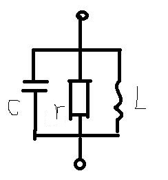

这个电路和串联谐振回路的构成形成了鲜明的对比，串联谐振回路三者都是串联，而并联谐振回路三个元件都是并联。实际上，**并联谐振回路也是整本书里用得最多的电路，串联谐振回路和实际中的并联谐振回路基本可以略过不看**。

#### 阻抗分析

$$\frac 1 Z = \frac 1 r + j\omega C + \frac 1 {j\omega L} = \frac 1 r + j(\omega C - \frac 1 {\omega L})$$

根据复数模值的性质，可知$$\frac 1 {\left|Z\right|}=\left|\frac 1 Z\right|$$，因此

$$\left|Z\right|=\frac 1 {\left|{\frac 1 Z}\right|}=\frac 1 {\sqrt{(\frac 1 r)^2+(\omega C - \frac 1 {\omega L})^2}}$$

定性分析可知模值应该是先增大后减小的。

在matlab里验证一下：

```matlab
clear, clc

syms r omega L C real
Z = 1 / (1/r + i * (omega * C - 1/(omega * L)));
modulus = abs (Z);
f = subs (modulus, [L, C, r], [1*10^(-4), 4*10^(-4), 1*10^2]);

start = 4500;
over = 5500;
range  = (start:(over-start)/1000:over);
range (range == 0) = [];
impedance_modulus = subs (f, omega, range);
impedance_modulus = double (impedance_modulus);

plot (range, impedance_modulus);
axis ([start, over, 0, 120]);
ylabel ('$\left|Z\right|$', 'Interpreter', 'latex')
xlabel ('$\omega$', 'Interpreter', 'latex', 'FontSize', 15, ...
    'FontWeight', 'bold')

find (impedance_modulus == max (impedance_modulus))
```

得到的图像是这样的：

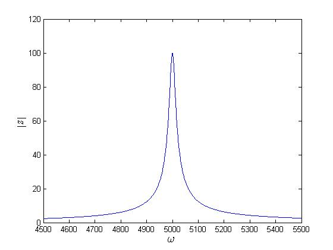

#### 并联谐振频率

这里并联谐振频率的求法与串联谐振频率的求法相同，都是令$Z$的虚部等于零。

整理得到的$Z$为：

$$Z=\frac{\omega^2L^2r+j(\omega Lr^2-\omega^3L^2Cr^2)}{1+\omega^4L^2C^2r^2 - 2\omega^2LCr + \omega^2 L^2}$$

$$Imag(Z)=0\Rightarrow \omega_0 = \frac 1 {\sqrt {LC}}$$

可以看出，并联谐振频率的值与串联谐振频率的值相同。当电路的频率达到并联谐振频率时，回路的阻抗模值有最大值，这个最大值等于电阻的阻值。

####品质因数

不妨设$$u=\sqrt 2 U\cos \omega t$$，则有$$i_L = \frac {\sqrt 2 U}{\omega L}\cos (\omega t - \frac \pi 2)=\frac{\sqrt 2 U}{\omega L}\sin \omega t$$

此时，电阻、电感、电容上的能量分别为：

$$W_r = \frac {U^2} r T = \frac {U^2}r \frac{2\pi}\omega$$

$$W_L = \frac 1 2 L i_L^2 = \frac 1 2L\cdot\frac{2U^2}{\omega^2L^2}\sin^2 \omega t$$

$$W_C = \frac 1 2 Cu^2 = \frac 1 2 C\cdot2U^2\cos^2\omega t$$

将其代入$Q$的计算公式$$Q = 2\pi \frac{(W_L+W_C)_{max}}{W_R}$$，可得

$$Q = \omega r(\frac 1 {\omega^2L}\sin^2\omega t + C\cos^2\omega t)_{max}$$

同样地，这个式子没法再化简了，而且很难有结论。只能对$\omega$赋值化简式子。

当$$\omega=\frac 1 {\sqrt{LC}}$$时，有$$Q=r\sqrt{\frac C L}$$

这个频率恰好为谐振频率，若设$$\omega_0 = \frac 1 {\sqrt{LC}}$$，则$Q$可表示为

$$Q = \omega_0 r C = \frac r {\omega_0 L}$$

#### 题目中电感值的实用计算公式

当$f_0$以MHz为单位，C以pF为单位，L以μH单位时，并联谐振回路中电感的计算公式为：

$$L = \frac{25330}{f_0^2\cdot C}$$

### 实际中的并联谐振回路

实际中常用的谐振电路是这样的：

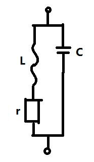

#### 阻抗分析

$$Z = \frac{(r+j\omega L)\frac 1 {j\omega C}}{r+j\omega L + \frac 1 {j\omega C}}$$

经过整理，可以得到这样的表达式：

$$Z=\frac{r+j\omega(L - \omega^2L^2C-Cr^2)}{\omega^4L^2C^2+\omega^2(C^2r^2-2LC)}$$

其模值的计算过于复杂，在这里就不推导了，但是可以画出这样的图像：

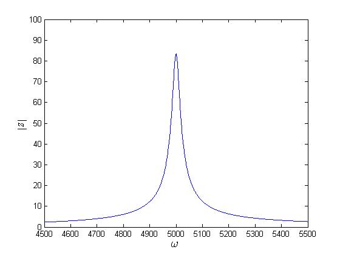

代码如下：

```matlab
clear, clc

syms r omega L C real
Z = (r+i*omega*L)/(i*omega*C*(r+i*omega*L)+1);
modulus = abs (Z);
f = subs (modulus, [L, C, r], [1*10^(-4), 4*10^(-4), 3*10^-3]);

start = 4500;
over = 5500;
range  = (start:(over-start)/1000:over);
range (range == 0) = [];
impedance_modulus = subs (f, omega, range);
impedance_modulus = double (impedance_modulus);

plot (range, impedance_modulus);
axis ([start, over, 0, 100]);
ylabel ('$\left|Z\right|$', 'Interpreter', 'latex')
xlabel ('$\omega$', 'Interpreter', 'latex', 'FontSize', 15, ...
    'FontWeight', 'bold')

find (impedance_modulus == max (impedance_modulus))
```

我们可以看到，这个幅频特性与并联谐振回路相同。

实际上，当$$\frac{r^2C}L \ll 1$$时，就可以将其等效为标准并联谐振回路。假设实际并联谐振回路中的电阻为$r$，标准并联谐振回路中的为$R$，则有以下换算关系：

$$R = \frac 1 r \cdot \frac L C$$

这里的等效意思可能是：谐振频率$\omega_0$相同，幅频特性相同，相频特性相同。具体的换算关系我不知道是怎么来的。至于到底等效不等效我也没能从公式中推导出来。

其相频特性如下所示：

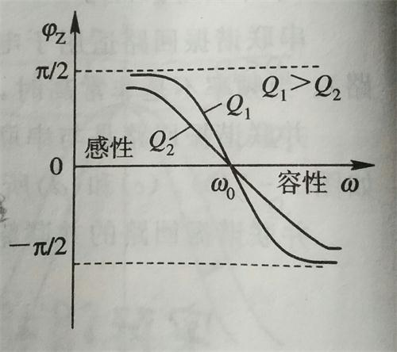

这个相频特性和并联谐振回路的相频特性是相同的，它们都有两个特点：

1.  随着频率的增加，都是从$\pi /2$降到$-\pi /2$，即从感性降到容性。
2.  随着Q的增大，下降的速度会变快。

#### 谐振角频率

取$Z$的虚部，然后令其等零，即$$Imag(Z) = 0$$

得到$$\omega^2CL^2-L+r^2C=0$$

进而解得$$\omega_0 = \frac 1 {\sqrt{LC}}{\sqrt{1-r^2\frac C L}}$$

当$$r^2\frac C L \ll1$$的时候，就有$$\omega_0 \approx \frac 1 {\sqrt{LC}}$$。

#### 品质因数

我们可以将实际的并联谐振回路等效变换成标准并联谐振回路后再求品质因数，得到：

$$Q = \omega_0 rC = \frac r {\omega_0 L}$$

### 对Q的再思考

真实的$Q$其实是和$\omega$及电路的组成有关的，但是在这里的上下文中，$Q$特指的是在$\omega_0$处的$Q$。

对于某一个已知的电路，其谐振频率$\omega_0$可以直接计算出来，而$Q$又特指$\omega_0$处的$Q$，因此可以说，对于一个已知的电路，其$Q$值也是已知的，也就是说$Q$可以看作是一个电路特有的属性值。正因为如此，我们可以把$Q$值放在$\omega_0$的表达式里，也可以把$\omega_0$放在$Q$的表达式里，因为这样表示更好看，也好记一些。我们需要知道的是，无论是$\omega_0$还是$Q$，都可以用$r, L, C$这三个基本参数直接计算出来。

实际的并联谐振回路中，$$\omega_0 = \frac 1 {\sqrt {LC}}\sqrt{1-\frac 1 {Q^2}}$$，当$$Q\gg 1$$时，$$\omega_0 \approx \frac 1 {\sqrt{LC}}$$

### 通频带的计算

对于串联谐振回路，$$\frac I {I_0}\ge\frac 1 {\sqrt2}$$对应的频带是通频带。

对于并联谐振回路，$$\frac {\left|Z\right|}{R_0}\ge\frac 1 {\sqrt 2}$$对应的频带是通频带。

### 失谐


## 抽头并联振荡回路

### 双电容分压电路

当使用低频电路时，我们只能用电阻分压，使用过的人都会发现，当电流变大时，电阻就会变得很烫，甚至会被烧坏。当电路的频率提升后，我们不仅可以用电阻分压，还可以用电容或电感分压分压。用电容或电感分压的好处是，它们都是储能元件，在高频电路中几乎不消耗能量，因此不会产生热，也不会损失能量。

下图是个基本的双电容分压电路图：

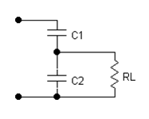

在双电容分压电路中，当频率高到一定程度时，有$$\frac{V_2}{V_1}=\frac{C_1}{C_1+C_2}$$

其中$V_1$指的是两个电容上的总电压，$V_2$指的是$C_2$上的电压。

在multisim里做个实验验证一下这个公式：

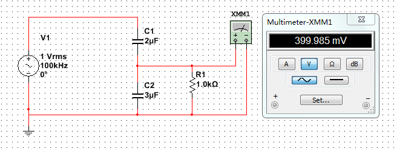

可以看到，在100kHz下，1V的电源被分压成了399.99 mV。

用公式计算：$$V_2 = \frac{C_1}{C_1+C_2}V_1=\frac{2\mu\text F}{2\mu\text F+3\mu \text F}V_1=0.4V_1=400\ \text{mV}$$

果然一样。

接下来我们看一下幅频响应如何：

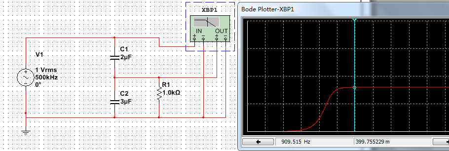

从bode图里我们看到，随着频率的升高，$C_2$上的电压上升到了一个稳定的值。

### 电感抽头分压电路

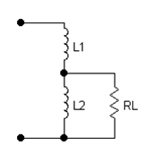

电感抽头回路的作用同双电容分压电路，假设两电感没有互感，当频率**在一定值以下**时，有$$\frac{V_2}{V_1} = \frac {L_2}{L_1+L_2}$$

其中$V_1$指的是两个电感上的总电压，$V_2$指的是$L_2$上的电压。

在multisim里做实验如下：

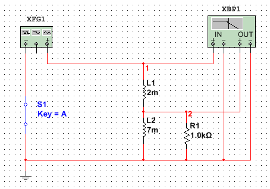

（需要注意的是，电路中必须要加一个开关才能正常仿真，不然会提示说 matrix is singular之类的）

画出的波特图是这样的：

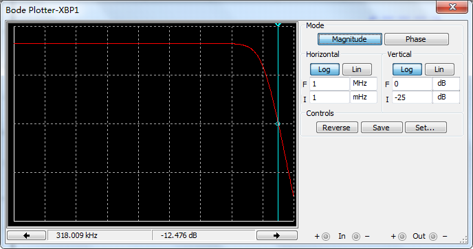

从图中我们可以看出，随着频率的升高，$V_2$上的电压逐渐减小。

### 抽头并联振荡回路

刚才我们一直在说如何用电容或电感来分压，如果把这个电路和前面讲的并联谐振回路联系起来，就可以构成具有谐振特性的抽头并联振荡回路。

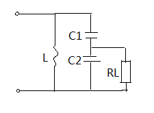

上图即是一个用双电容分压的，带有谐振性质的回路。

我们用仿真软件测试一下它的性能和只有双电容分压的电路有何不同：

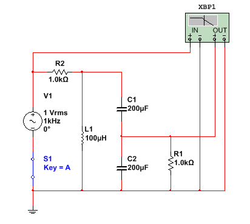

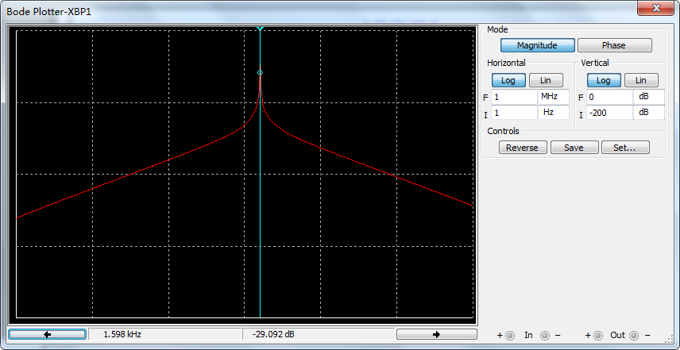

从波特图中可以看出，在频率为1.598 kHz的时候，负载两端的电压和电源电压的比值有一个峰值，此时谐振回路的阻抗最大，正好是并联谐振回路的谐振特性。

理论上其谐振频率为$$f_0 = \frac{1}{2\pi \cdot \sqrt{1\times10^{-4}\times 1\times10^{-4}}}\approx 1.59\ \text{kHz}$$

（**两个电容串联，总电容的倒数等于两串联电容的倒数和**）

理论值和实际值相符。

当没有电路中的那个电感时，情况又是怎样的呢？

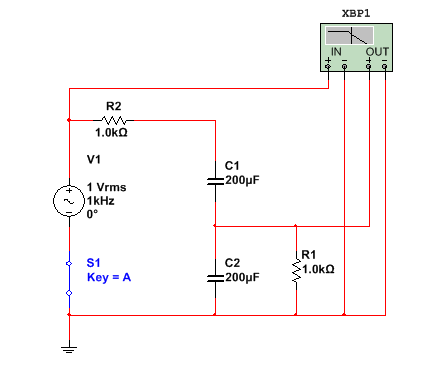

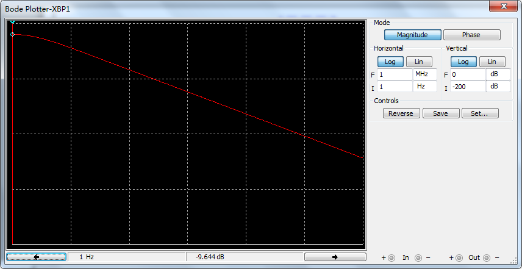

我们可以看到，其波特图随频率的变化没有明显的谐振特性。拿掉电感后，电路的谐振特性消失了。

电感抽头谐振回路的分析方法与电容分压谐振回路相似。

相关资料：

[这个网站用阻抗变换的方式计算了电感抽头谐振电路的参数](http://analog.intgckts.com/impedance-matching/tapped-capacitor-matching/)

### 接入系数与折算分析

接入系数p的定义如下：

$$p = \frac {外电路相连的那部分电抗}{本回路参与分压的同性质总电抗}$$

由于电抗之比等于电压之比，因此$p$也可以用电压来表示：

$$p = \frac{接入处电压}{谐振回路总电压}=\frac{U}{U_T}$$

在实际计算的时候，对于电感的接入系数和电容的接入系数有个小区别：

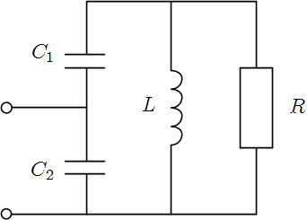

在电容抽头电路（如上图）中，$$p =  \frac {C_1}{C_1+C_2}$$

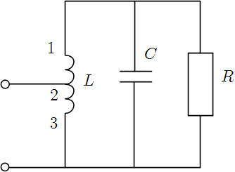

但是在电感抽头电路（如上图）中，$$p = \frac {L_{23}}{L_{13}}$$

为什么两个表达式，分子上电容算的是上面那部分，而电感算的是下面那部分呢？因为根据接入系数$p$的定义，在计算电抗的时候，电容用的是$$\frac 1 {\omega C}$$，而电感用的是$$\omega L$$，因此两者不同。

有了接入系数$p$，就可以方便地对抽头电路进行描述了。

为什么这样的分压电路会有阻抗变换的功能呢？

可以这样理解：本来没有抽头电路时，分到负载$R_L$上的电压主要与$R_L$和信号内阻$R_S$有关。当信号内阻$R_S$特别大而负载$R_L$特别小时，$R_L$上就会分得很小的电压，因此分得的能量也少，这样就无法满足我们的要求。而抽头电路就好像一面墙，隔离了信号源与负载，使得负载$R_L$上的电压与信号源内阻$R_S$无关。因此，对于信号源来讲，好像是输出阻抗变大了；对于负载来讲，好像是输入阻抗（信号内阻）变小了。这个过程就是阻抗变换的过程。

正是因为有这面“墙”的存在，从信号源角度看，负载的阻值、电压、电流发生了变化；从负载的角度看，信号源的相应参数也发生了变化。具体怎么变化，变化了多少呢？我们可以先定义一个“部分接入”的概念，然后用一些公式计算。

**部分接入**指的是没有完全接在谐振回路两端的元器件或电源。以下几种情况均是部分接入：

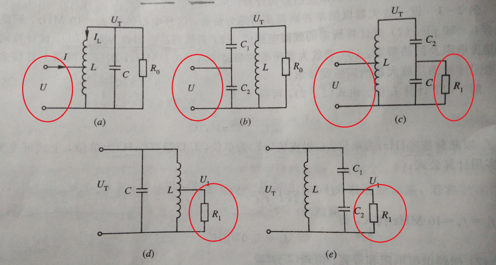

我们可以用以下公式来计算这些部分接入的参数等效到谐振回路两端时，变成了多少。

*   电阻$$R' = \frac{R}{p^2}$$
*   电压$$U_T = \frac U p$$
*   电流$$I_T = p\cdot I$$

无论部分接入的参数在电路的左边还是在电路的右边，这些公式都是成立的。

另外需要说明的一点是，想从并联谐振电路的两端折算到部分接入也是可以的，只不过把原来除以$p^2$的改成乘，把乘的改成除就可以了。

## 耦合振荡回路

耦合振荡回路是将两个谐振回路通过耦合的方式连在一起，构成一个新的谐振回路。最常用的耦合振荡回路可能就是用电容耦合的谐振回路了，它的电路图大概是这样的：

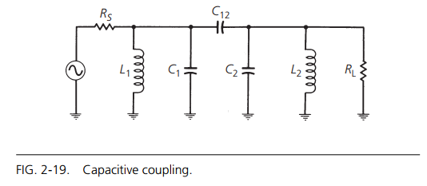

电路中的$C_{12}$起到了耦合的作用。

耦合振荡回路的相关参数推导很麻烦，只需要记住有个**耦合因数h**（书上是A）就可以了。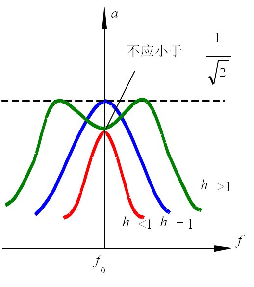

从上图可以看出，h的取值情况不同时，通频带的表现也不尽相同。h < 1时定义为欠耦合，h = 1时定义为临界耦合，h > 1时定义为过耦合。

需要记的结论很少：

1.  临界耦合时，通频带$$BW=\sqrt 2 \frac{f_0}{Q_L}$$，矩形系数$$K_r = 3.15$$。而对于单LC谐振回路来说，通频带$$BW=\frac {f_0}{Q_L}$$，$$K_r = 9.96$$
2.  h = 2.14时，双峰谷点值为-3dB，此时$$BW=3.1\frac{f_0}{Q_L}$$
3.  耦合振荡回路的特点是矩形系数小，通频带宽，性能优于单LC谐振回路。

## 变压器耦合


## LC匹配网络

前面的简单LC谐振回路只能解决选频的问题，但是无法阻抗变换。抽头振荡电路利用电抗元件在高频时的分压原理同时完成了选频和阻抗变换的任务，LC匹配网络则是利用串并联阻抗变换公式完成了选频和阻抗变换的任务。可以说两种方法各有千秋。

### 串并联阻抗变换公式

下图展示了串并联阻抗变换的过程，下标s代表series（串联），p代表parallel（并联）。

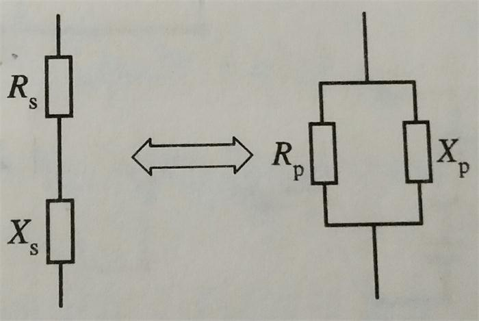

根据总阻抗相等原理，有$$\frac 1 {R_p} + \frac 1 {jX_p} = \frac 1 {R_s+jX_s}$$

由此式可解出

$$R_p = \frac{R_s^2+X_s^2}{R_s} = R_s\cdot (1+(\frac {X_s}{R_s})^2)$$

$$X_p = \frac {R_s^2+X_s^2}{X_s} = X_s\cdot (1+(\frac {R_s}{X_s})^2)$$

我们看看能从这两个公式里推出来什么结论。当$$\frac{X_s}{R_s}$$很大时，由第一个式子可知$$R_p \gg R_s$$，由第二个式子可知$$X_p \approx X_s$$。

从这个电路及品质因数$Q$的定义出发，又可以恰好推出来$$Q = \frac{X_s}{R_s} = \frac {R_p}{X_p}$$。于是我们可以用$Q$把上面的结论再描述一遍：当$$Q\gg 1$$时，有$$R_p\gg R_s$$，$$X_p\approx X_s$$。

### L型网络

L型网络有两种形式，分别如下图所示：

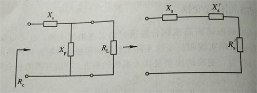

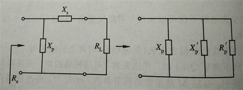

其中，$X_s$和$X_p$分别是不同性质的电抗（不然就没法形成谐振性质啦）。

我们可以看到，两种不同形式的L型网络都可以经过串并联阻抗变换公式转换成简单谐振回路，这样就可以分析其谐振特性了。这里我们不做复杂的计算，只说一些有用的结论：

1.  对于第一种L型网络，品质因数$$Q = \sqrt {\frac {R_L}{R_s'}-1} = \sqrt{\frac{R_L}{R_e}-1}$$，其中$R_e$为信号源内阻。对于第二种L型网络，品质因数$$Q = \sqrt{\frac{R_p'}{R_L}-1} = \sqrt {\frac {R_e}{R_L}-1}$$ 。
2.  对于整个电路，由于同时存在信号源内阻和负载，有载$Q$值变成$Q/2$，通频带变成$2f_0/Q$。
3.  谐振角频率$$\omega_0 = \frac{\sqrt{1 - 1/Q^2}}{\sqrt{LC}}$$。

通过以上的结论，我们可以看出来L型网络的一些缺点：如果已知信号源内阻和负载的大小时，其实$Q$值就已经确定了。而电抗元件的参数也可以由$Q$值唯一确定，因此L型网络虽然可以完成阻抗变换的任务，但是无法完成选频的任务。为了解决这个问题，我们可以用T型或π型网络。

### T型和π型网络


## 传输线变压器

传输线变压器指的是将两根导线并排缠绕在一个磁环上所构成的一种变压器，其构造示意图和在电路中的画法如下所示：

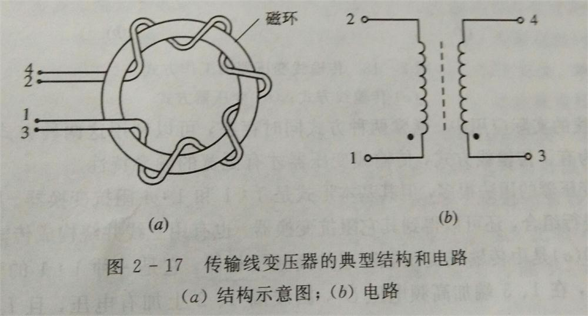

传输线变压器在电路中经常以这样的形式存在：

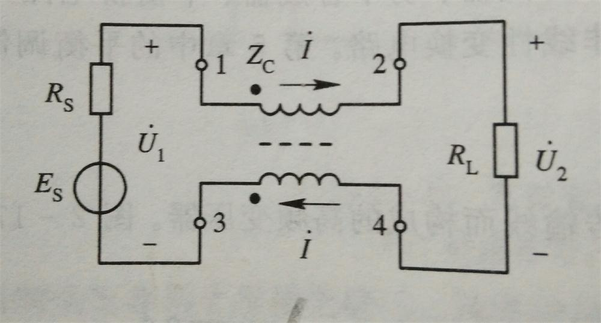

其最重要的特性只需要记住两点：

1.  $$U_{13} = U_{24}$$
2.  $$I_{12} = I_{43}$$

不论传输线变压器怎么接线，这两条规律都是一定成立的。

传输线变压器的主要作用是**阻抗变换**，特点是**通频带宽**，因此常用于电视信号接头的阻抗变换。

### 反相器

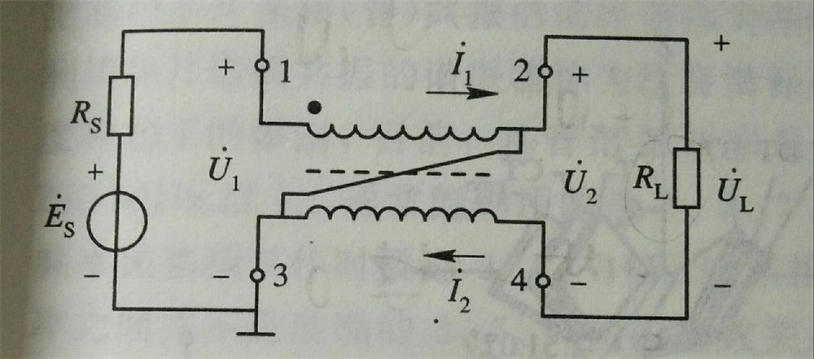

如图所示，将传输线变压器的2端口和3端口用导线连起来，然后将3端口接地，即构成了一个反相器。那么它到底是如何反相的呢？

首先运用传输线变压器的两条规律分析，即$$U_1=U_2$$，$$I_1 = I_2$$。由于3端口接地，2端口连着3端口，因此2端口和3端口的电压都是0。因此1端口处电压为$U_1$，4端口处电压为$-U_2$，又因为$U_1=U_2$，所以4端口处的电压为$-U_1$。

此时我们发现，流经$R_L$的电流不变，但是电压$U_L=-U_1$，因此电压反相了。所以说这个结构构成了一个反相器。

### 1:4 阻抗变换器

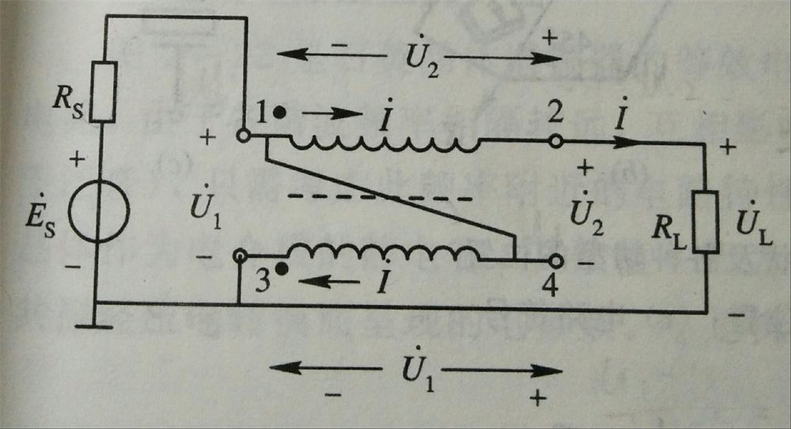

上图即是一个用传输线来做阻抗变换的例子，这个电路仍然是3端口接地，但这次不是端口2和3相连，而是改成了1和4相连，同时，4端口也不再和负载相连了。如何分析这幅图呢？

首先还是列出两条传输线变压器的规律，$U_1=U_2$，$I_{12}=I_{43}$，我们看看由这两条规律能推出什么。

设左边信号源处顺时针方向的电流为$I_s=I_{12}+I_{14}$，在传输线结构上，有$I_{14}=I_{43}=I_{12}$，因此$I_s=2\cdot I_{12}$。在负载回路中，设顺时针的电流$I_L=I_{12}$。

因为端口3接地，因此端口3处电压为0，端口1处电压为$U_1$。因此端口1和端口4用导线相连，所以端口4处电压也为$U_1$。端口2处电压为$$U_2+U_1=2\cdot U_1$$，即$$U_L=2\cdot U_1$$。

这样一来，我们就可以写出电阻$R_L$的表达式了：$$R=\frac{2\cdot U_1}{I_{12}}$$

在信号源回路计算一下输出阻抗又是多少呢？$$R' = \frac {U_1}{2\cdot I_12}$$

显然，$R'$与$R$之间存在着倍数关系，即$$R' = \frac 1 4 R$$。什么意思呢？本来阻值为$R$的负载，在信号源看来，只有$$\frac 1 4 R$$。也就是说，传输线变压器减小了负载的阻抗。
