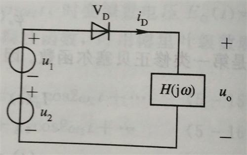
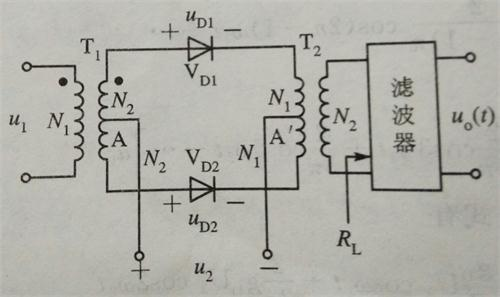
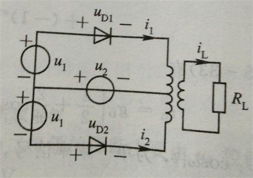
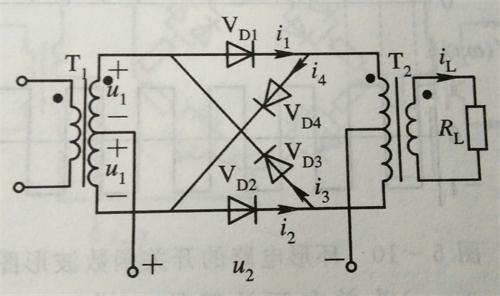
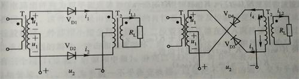
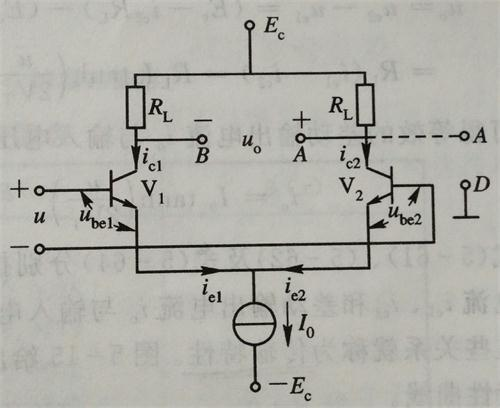
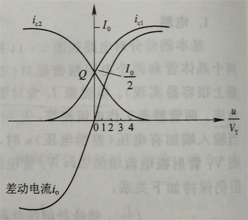
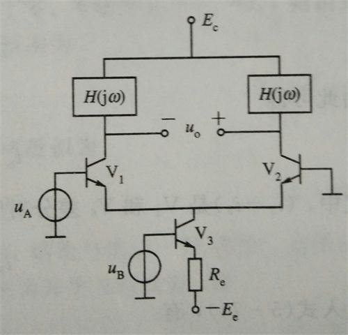
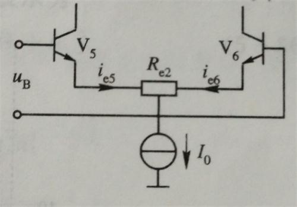

# 频谱的线性搬移网络

频谱的搬移电路的特点是*将输入信号进行频谱变换*。

**线性搬移电路**的特点是*搬移前后各频率分量的比例关系不变，只是在频域上简单的搬移（允许只取其中的一部分）*。而**非线性搬移电路**的特点是*输入信号的频谱不仅在频域上搬移，而且频谱结构也发生了变化。* 

## 非线性电路的分析方法

线性电路并不产生新的频率分量，只有非线性电路才会产生新的频率分量。因此频谱的搬移必须用非线性电路来完成。

大多数频谱搬移电路所需要的是非线性函数展开式中的平方项，或者说，是两个输入信号的乘积项。因此要想完美地搬移频谱，就需要实现一个完美的乘法器。

### 非线性函数的级数展开分析法

设非线性元件伏安特性为$$i = f(u)$$，其中$$u = E_Q+u_1+u_2$$，$E_Q$为静态工作点，$u_1$为输入信号，$u_2$为控制信号。用泰勒展开后，得到

$$i = a_0 + a_1(u_1+u_2) + a_2(u_1+u_2)^2 + \cdots + a_n(u_1+u_2)^2 = \sum_{n=0}^{\infty}a_n(u_1+u_2)^n$$

当$u_2 = 0$时，经过一系列的化简，得到$$i = \sum_{n=0}^\infty b_nU_1^n\cos n\omega_1t$$

由上式可以看出，当单一频率信号作用于非线性器件时，在输出电流中不仅包含了输入信号的频率分量$\omega_1$，而且还包含了该频率分量的各次谐波分量$n\omega_1 \ \ (n=2,\,3,\,\cdots)$。由此我们可知道，只加一个信号时，我们最多只能得到各次谐波分量，还无法完成搬移频谱的功能。

当$u_1$和$u_2$同时存在时，我们需要$2a_2u_1u_2$这一项来完成频谱搬移，它是由泰勒展开中的二次方项产生的。其它的各项都要通过滤波器滤掉。

### 线性时变电路分析法

若$u_1$足够小，则可以用各一种方法泰勒展开：$$i \approx f(E_Q+u_2)+f'(E_Q+u_2)u_1$$

进而可以写成：$$i = I_0(t) + g(t)u_1$$。其中$I_0$称为时变静态电流，$g(t)$称为时变跨导。

这个式子描述的就是线性时变工作状态。

线性时变电路相对于非线性电路的输出中的组合频率分量大大减少，但二者的实质一致。选择线性时变工作状态后，高次分量幅度相对于低阶的分量要小很多，因而被忽略。线性时变分析方法是在非线性电路的级数展开分析法的基础上，在一定的条件下的近似。

## 二极管电路

### 单二极管电路

电二极管电路的原理图如下：

上图中，$u_1$是输入信号，$u_2$是控制信号，两个信号相加，作用在非线性器件二极管上 。其中，一般$u_2$为一正弦波，可设$u_2 = U_2\cos\omega_2 t$。二极管上的压降$u_D = u_1 + u_2$。

二极管电路本是非线性电路，如果想用线性时变电路来近似，必须做两点假设：

1.  $U_2 \gt 0.5 \Rightarrow$ 二极管主要工作在截止区和线性区，伏安伏安特性可用折线近似。
2.  $U_2 \gg U_1 \Rightarrow$ 二极管开关主要受$u_2$控制。

如果忽略二极管$V_D$的开启电压，则二极管上的电流为

$$i_D = \begin{cases}g_Du_D  &u_2 \geqslant 0 \\ 0  &u_2 \lt 0 \end{cases}$$

假如控制电压$$u_2 = U_2 \cos \omega_2 t$$，则上式还可以写成

$$i_D = \begin{cases} g_Du_D  &2n\pi - \frac \pi 2 \leqslant \omega_2 t \lt 2n \pi  + \frac \pi 2 \\ 0 &2n\pi + \frac \pi 2 \leqslant \omega_2 t \lt 2n\pi + \frac{3\pi}2\end{cases}$$

经过分析可以得到，渡过二极管的电流$i_D$中的频率分量有：

1.  输入信号$u_1$和控制信号$u_2$的频率分量$\omega_1$和$\omega_2$。
2.  控制信号$u_2$的频率$\omega_2$的谐波分量
3.  $\omega_1$与$\omega_2$的奇次谐波分量的组合$(2n+1)\omega_2 \pm \omega_1$，$n = 0，1，2$

假如前面所述的那两点假设不满足，则电路不能等效为线性时变电路，但仍是一非线性电路，可以完成频谱的线性搬移功能。这时可以用级数展开的非线性电路分析方法来分析。

### 二极管平衡电路

二极管平衡电路的原理图如下所示：

同单二极管电路，$u_1$为输入电压，$u_2$为控制电压。

假设$N_1:N_2 = 1:1$，则可将上述原理图等价为下述电路图：

经分析可以得到，输出电流$i_L$中的频率分量有：

1.  输入信号的频率分量$\omega_1$
2.  控制信号$u_2$的奇次谐波分量与输入信号$u_1$的频率$\omega_1$的组合分量$|\pm(2n+1)\omega_2\pm\omega_!|$，$n = 0，1，2，\cdots$。

与单二极管电路相比较，$u_2$的基波分量和偶次谐波分量被抵消了。

### 二极管环形电路

可以将以上原理图拆分为下面两个电路：

经分析可得输出电流：$$i_L = 2g_DK'(\omega_2t)u_1$$，其中$K'(\omega_2t)$为双向开关函数，$$K'(\omega_2t) = \begin{cases} &1,  &u_2 \geqslant 0  \\ &-1,  &u_2 \lt 0\end{cases}$$

在环形电路中，输出电流$i_L$只有控制信号$u_2$的基波分量和奇次谐波分量与输入信号$u_1$的频率$\omega_1$的组合频率分量$(2n+1)\omega_2\pm\omega_1 (n = 0,1,2,\cdots)$。在平衡电路的基础上，又消除了输入信号$u_1$的频率分量$\omega_1$，且输出的$(2n+1)\omega_2 \pm \omega_1 (n = 0,1,2,\cdots)$的频率分量的幅度等于平衡电路的两倍。每个平衡电路自身抵消$\omega_2$及其谐波分量，两个平衡电路抵消$\omega_1$分量。

## 差分对电路

差分对电路使用**可变跨导相乘法**实现了一个相乘器。可变跨导相乘法利用一个电压控制晶体管射极电流或场效应管源极电流，使其跨导随之变化从而达到与另一个输入电压相乘的目的。

### 单差分对电路

单差分对电路图如下：

假设输入的差模电压为$u$，输出电压为$u_o$，经过一系列的推导，我们可以得到如下结论：

$$i_{c1} = \frac{I_0}{2} + \frac{I_0}2 \tanh (\frac u {2V_T})$$

$$i_{c2} = \frac{I_0}{2} - \frac{I_0}2 \tanh (\frac u {2V_T})$$

双端输出时，有$$i_o = I_0\tanh (\frac u {2V_T})$$

这三个式子都反映了各个地方的电流随输入电压$u$的变化关系，称为**传输特性**。其中，最重要的是$i_o$随$u$的变化关系。我们可以得到传输特性的曲线如下：

我们可以对输入信号的大小分两种情况讨论：

1.  当输入电压很小时，传输特性近似为线性关系。即当$\left|u\right|<26\ \text{mV}$时，$$i_o\approx I_0\frac{u}{2V_T}$$。此时$$g_m = \left. \frac{\partial i_o}{\partial u}\right|_{u=0} = \frac{I_0}{2V_T}\approx 20I_0$$，于是我们可以看出，$g_m$与$I_0$成正比。若$I_0$随时间变化，$g_m$也随时间变化，成为时变跨导$g_m(t)$。因此，可用控制$I_0$的办法组成线性时变电路。
2.  当输入电压很大时，电路呈现限幅状态。一般$|u|\gt 100\; \text{mV}$。

在单差分对电路的基础上，我们可以构造出差分频谱搬移电路，电路图如下：

这个电路又叫**长尾偶电路**，其可控通道有两个：一个为输入差模电压，另一个为电流源$I_0$。将前一个通道称为非线性通道，后一个通道称为线性通道。恒流源$I_0$由尾管$V_3$提供，$V_3$射极接有大电阻$R_e$，可削弱$V_3$的发射结非线性电阻的作用（这句看不懂）。

经过推导，我们可以得到输出电流$$i_0(t) = I_0(1+\frac{u_B}{E_e})\tanh(\frac{u_A}{V_T})$$

当$|u_A|<26\ mV$时，有$$i_o(t) \approx I_0(1+\frac{u_B}{E_e})\frac{u_A}{2V_T}$$

这样就构造出来了乘积项，可以完成频谱线性搬移的任务了。

### 双差分对电路

双差分对电路的电路图如下所示：

这个电路的主要作用是构造出**理想乘法器**。

经分析得输出电流为$$i_o = I_0\tanh(\frac{u_A}{2V_T})\tanh(\frac{u_B}{2V_T})$$，当$u_A$和$u_B$都是小信号时，有$$i_o = \frac{I_0}{4V_T^2}u_1u_2$$。

为了扩大$u_B$的动态范围，可以接入负反馈电阻$R_{e2}$，如下图所示：

当$R_{e2}$足够大时，有$$u_B \approx \frac 1 2(i_5 - i_6) R_{e2}$$，因此当接入负反馈电阻后，差分对管$V_5$和$V_6$的差动输出电流近似与$u_B$成正比，而与$I_0$的大小无关。经过分析，可得$u_B$的动态范围为$$-\frac{I_0}{2} \leqslant \frac{u_B}{R_{e2}} \leqslant \frac{I_0}{2}$$。当$u_A$在线性区时，差动输出电流约为$$i_o\approx \frac{2u_B}{R_{e2}}\tanh(\frac{u_A}{2V_T})$$，而当$u_A$在平坦区时 ，$$i_o \approx \frac{2}{R_{e2}}K(\omega_At)u_B$$。