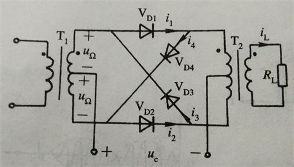

# 振幅调制、解调及混频

## 振幅调制

*调制信号*是原始信息，通常用$u_\omega$或$f(t)$表示。未受调制的高频振荡信号称为*载波*，用$u_c$和$i_c$表示。受调制后的振荡波称为*已调波*。

*振幅调制*指的是使高频振荡的振幅与调制信号成线性关系，其它参数（频率和相位）不变。调幅波（AM），双边带信号（DSB）和单边带信号（SSB）都属于振幅调制信号。

### 振幅调制信号分析

通常有关载波的量用下标$C$表示，表示调制信号的量用下标$\Omega$表示。大写的$U$表示振幅，小写的$u$表示具体的交流信号。

为了简化分析，我们只分析简单的正弦波信号。

一般设载波$\omega_C = U_C \cos \omega_C t$，调制信号$$u_\Omega = U_\Omega \cos \Omega t$$ 。

#### 调幅波（AM）

**波形**

根据振幅调制的定义，可以得到调幅波的振幅表达式$$U_{AM} = U_C + k_a U_\Omega \cos \Omega t$$，可以看出，调幅波的振幅与调制信号成线性关系。

若令调制度$$m = \frac {k_a U_\Omega}{U_C}$$，则可将上式写为$$U_{AM} = U_C (1 + m \cos \Omega t)$$

因此可以得到普通调幅波表达式：$$u_{AM} = U_{AM} \cos \omega_C t = U_C (1 + m \cos \Omega t) \cos \omega_C t$$

通常情况下，$m \lt 0.5$。当$m \gt 1$时，会产生严重的失真，称为过调制。

对于一般的调制信号$f(t)$，$u_{AM}(t) = U_c (1 + m f(t)) \cos \omega_c t$ 。

**频谱**

可以将$u_{AM}$改写为$$u_{AM} = U_C \cos \omega_C t + U_C \cdot m \cos \Omega t \cos \omega_C t$$

将后面一项用积化和差公式展开，可以得到

$$u_{AM} = U_C \cos \omega_C t + \frac 1 2 m U_C \cos (\omega_C + \Omega)t + \frac 1 2 m U_C \cos (\omega_C - \Omega) t$$

调幅波包含三个频率分量，载波分量$\omega_C$，两个边频分量$\omega_c \pm \Omega$。调制信号的幅度及频率消息只含于边频分量中。

假如调制信号不是简单的正弦波信号，那么边频就会形成一个边频带。上边带与下边带以载频为中心互为**镜像**。

**功率**

调幅波的功率可以根据频率分为两个部分，一是载频的功率$P_C$，另一个是边频的功率$P_{\omega_C \pm \Omega}$ 。

载频的功率$$P_C = \frac {U_C^2}{2R_L}$$  （分母上有2是因为载波是正弦波，而不是直流信号）

边频的功率$$P_{\omega_C + \Omega} = P_{\omega_C - \Omega} = \frac {m^2}{4} P_C$$

AM信号的平均功率为载频功率和边频功率之和，即$$P_{av} = P_c \left( 1 + \frac {m^2} 2 \right)$$

在AM波中，不携带调制信号分量的载频占去了2/3以上的功率，而带有信息的边频功率不到总功率的1/3，功率浪费大，效率低。

#### 双边带信号（DSB）

在普通AM调制的基础上，过滤掉载波频率后的信号就是双边带信号。其表示式为$$u_{DSB}(t) = kU_c U_{\omega} \cos \Omega t \cos \omega_c t$$。

双边带信号与普通AM波的不同之处有两个：

1.  包络不同。DSB信号的包络为$|\cos \Omega t|$，AM波的包络为$|1+m\cos \Omega t|$。
2.  DSB信号的高频载波相位在调制电压零交点处（调制电压正负交替时）要突变$180^\circ$。

DSB信号已非单纯的振幅调制信号，而是既调幅又调相的信号。

抑制载波的原因：提高功率利用率。

#### 单边带信号（SSB）

DSB信号再过滤掉一个边带信号，即得到单边带（SSB）信号。

单边带调制从本质上说是幅度和频率都随调制信号改变的调制方式。

单边带信号特点：

1.  包络为一水平线，但幅度与调制信号幅度成正比。
2.  频率随调制信号频率F变化。
3.  功率利用率高。
4.  $B = F_{max}$

### 振幅调制电路

AM、DSB和SSB信号的共同点是，都有一个调制信号$u_\Omega$与载波信号$u_c$的乘积项。

AM信号是在此乘积项的基础上加上载波或在$u_\Omega$的基础上加一直流后与$u_c$相乘得到的。

即$$u_C + u_\Omega \times u_C$$或$$u_C \times (1 + u_\Omega)$$

DSB信号是将调制信号$u_\Omega$与载波信号$u_c$直接相乘得到的。即$$u_C \times u_\Omega$$。

而SSB信号可以在DSB信号的基础上通过滤波来获得。

调制可分为高电平调制和低电平调制。高电平调制将功放和调制合二为一，主要用于AM信号。低电平调制将调制和功放分开，用于DSB、SSB及FM信号。

#### AM调制电路

实现AM波有两种思路。一种思路是利用乘法器，将$U_C \cos \omega_C t$和$(1 + k \cos \Omega t)$相乘，就可以得到AM波。另外一种方法是利用非线性器件的特性。

##### 高电平调制

**集电极调幅**

集电极调幅电路如下：

载波$u_c$被加到基极，信号$u_\Omega$被加到集电极，此时$$E_c = E_{c0} + u_\Omega$$，即集电极电源电压随调制信号变化，从而使集电极电流的基波分量随$u_\Omega$的规律变化。集电极调制应使放大器工作在**过压状态**。

**基极调幅**

基极调幅电路如下

图中$L_{B1}$是高频扼流圈，$L_B$为低频扼流圈，$C_1$、$C_3$和$C_5$为低频旁路电容，$C_2$、$C_4$和$C_6$为高频旁路电容。基极调幅与谐振功放的区别是基极偏压随调制电压变化。此时放大器工作在**欠压**状态。

##### 低电平调制

**二极管电路**

单二极管电路、二极管平衡电路以及二极管环形电路都可以得到AM波。

对于单二极管电路，只需要让$u_1 = u_\Omega$，$u_2 = u_C$，然后用以$\omega_C$为中心频率，带宽为2F的带通滤波器滤波，即可得到AM波。

对于二极管平衡电路，可以令$u_1 = u_C$，$u_2 = u_\Omega$，再经过带通滤波器，即可得到AM波。

**模拟乘法器**

#### DSB调制电路

DSB信号的获得，关键在于调制电路中的乘积项，故具有乘积项的电路均可作为DSB信号的调制电路。

##### 二极管调制电路

单二极管电路只能产生AM信号，不能产生DSB信号。二极管平衡电路和二极管环形电路可以产生DSB信号。

上图所示电路即为二极管平衡调制电路。第五章讲了一个二极管平衡电路，这里的调制电路即将$u_\Omega$作为$u_1$，$u_c$作为$u_2$，有$$U_c \gg U_\Omega$$。

分析可得

$$\begin{align}i_L &= 2g_D K(\omega_c t) u_\Omega \\ &= g_D U_\Omega \cos \Omega t + \frac 2 \pi g_D U_\Omega \cos (\omega_c + \Omega) t + \frac 2 \pi g_D U_\Omega \cos (\omega_c - \Omega) t \\ & - \frac {2}{3\pi} g_D U_\Omega \cos (3 \omega_c + \Omega) t + \frac {2}{3\pi} g_D U_\Omega \cos (3 \omega_c - \Omega) t + \cdots \end{align}$$

$i_L$中包含$\Omega$分量和$(2n + 1) \omega_c + \Omega$分量，$n = 0, 1, 2, \cdots$

在负载回路加上带通滤波器后，得到输出电压：

$$\begin{align} u_o(t) &= R_L \frac 2 \pi g_D U_\Omega \cos (\omega_c + \Omega)t + R_L \frac 2 \pi g_D U_\Omega \cos (\omega_c - \Omega) t \\ &= 4 U_\Omega \frac {R_L g_D}{\pi} \cos \Omega t \cos \omega_c t \end{align}$$

二极管平衡调制器采用平衡方式，将载波抑制掉，从而获得抑制载波的DSB信号。

另外一种实际中使用的二极管平衡电压如下图所示：

其基本原理与二极管平衡电路相同。

为进一步减少组合分量，可采用双平衡调制器（环形调制器），其电路图如下所示。

在二极管平衡调制电路中，$u_\Omega$加到$u_1$处，$u_c$加到$u_2$处，可以得到DSB信号，但两个信号的位置相互交换后，只能得到AM信号。在双平衡电路中，$u_c$、$u_\Omega$可任意加到两个输入端，完成DSB调制。

##### 差分对调制器

在单差分电路中，将载波电压$u_c$加到线性通道（$u_B = u_c$），调制信号$u_\Omega$加到非线性通道（$u_A = u_\Omega$），则双端输出电流

$$\begin{align} i_o(t) &= I_0 ()1 + m \cos \omega_c  t) \tanh \left( \frac {U_\Omega}{2 V_T} \cos \Omega t \right) \\ &= I_0 (1 + m \cos \omega_c t) [\beta_1(x) \cos \Omega t + \beta_3(x) \cos 3 \Omega t + \cdots] \end{align}$$

其中，$I_0 = E_e / R_e$，$m = U_C / E_e$，$x = U_\Omega / V_T$。

滤波后输出电压$$u_o(t) \approx I_0 R_L m \beta_1 (x) \cos \Omega t \cos \omega_c t = U_o \cos \Omega t \cos \omega_c t$$。

这种方式会出现$f_c \pm nF \ (n = 3,5,\cdots)$分量，不易滤除，从而出现包络失真。

使用双差分调制器，即可获得一个理想的乘法器，不加滤波器就可以得到DSB信号。

#### SSB调制电路

有两种方法可以获得SSB波，一种是对DSB波进行陡边带滤波得到SSB信号，另一种是用移相法获得SSB信号。

## 调幅信号的解调

### 调幅解调的方法

### 二极管峰值包络检波器

###同步检波

## 混频

## 混频器的干扰

