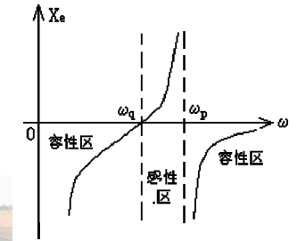

# 正弦波振荡器

*常用的振荡器有LC振荡器，晶体振荡器，RC振荡器等。*

## 反馈振荡器的原理

通常我们用正反馈来使放大器产生自激振荡，这个正反馈中最重要的两点是，**环路增益必须为1，反馈信号的相位必须和输入端信号的相位相同**。一般放大器是一个非线性网络，反馈网络是一个线性网络。

### 一些指标

以下的公式里，$s$指的是$j\omega$

*   放大器的放大倍数 $$K(s) = \frac{U_o(s)}{U_i(s)}$$

    即整体的输出电压比上净输入的电压。

*   放大器的闭环放大倍数$$K_u(s) = \frac{U_o(s)}{U_s(s)} = \frac {K(s)}{1-K(s)F(s)} = \frac{K(s)}{1 - T(s)}$$

    即整体的输出电压比上信号源的输入电压。

*   反馈网络的反馈系数$$F(s) = \frac{U_i'(s)}{U_o(s)}$$

    即反馈网络的输出电压$U_i'$比输入$U_o$

    反馈系数的模值用$K_F$表示，即$$K_F = \left|F(s)\right|$$

*   反馈系数的环路增益$$T(s) = K(s)F(s) = \frac {U_i'(s)}{U_i(s)}$$

    这个指标主要得和放大器的闭环放大倍数区别开。反馈系数的环路增益主要是针对反馈网络的输出与放大器的净输出来算的。其实为啥要定这么个指标我也不是很明白。

###平衡条件

其实如果仔细分析一下上面的原理图，就会发现，一个自激振荡器，哪来的信号源$U_s(s)$呢？干脆让它等于零好了。于是就出现了$$U_i(s) = U_i'(s)$$，即放大器的输入完全由反馈网络来提供。接着我们很快发现，$$T(s) = \frac{U_i'(s)}{U_i(s)} = 1$$。这个条件就是振荡器的平衡条件。

关于这个平衡条件我们还需要补充几点。首先请注意$T(s)$ 这个表示方式，这表明它是一个矢量，有大小有方向的。那么$$T(s) = 1$$这个等式就是一个矢量等式，也就是说模值$$\left|T(s)\right| = 1$$，幅角$$\arg T(s) = 0$$。

### 起振条件

###稳定条件

## LC振荡器

基本的LC振荡器又叫三端式振荡器，可以大概分成两类，一类是电容式，一类是电感式。由于电感式并不好调整参数，所以一般我们就用电容式。这里也着重介绍电容式。

三端式振荡器的一个特点是，电路中晶体管的三个电极分别和LC谐振回路的三个引出端相连，如下图所示：

为了构成振荡条件，电路中所有的电抗组成原则如下：

1.  $X_{be}$与$X_{ce}$同性质，同为电容或电感。

2.  $X_{bc}$与$X_{be}$、$X_{ce}$异性质

3.  $X_{be} + X_{bc} +X_{ce} = 0$

可以用**“射同余异”**来总结。

### 电容反馈振荡器

#### Colpitts 振荡器

Colpitts 振荡器是一种最简单的电容反馈振荡器。它的电路图如下图所示：

我们由此可以画出它的交流通路：

通过分析其等效电路，我们可以求出其振荡频率$\omega_1$。需要注意的是，受到三极管内部结构及反馈电路等的影响，振荡频率$\omega_1$并不完全等于负载的谐振频率$\omega_0$。但是$\omega_1$与$\omega_0$离得很近，因此可以近似认为$$\omega_1 \approx \omega_0 = \sqrt{\frac{1}{LC}}$$，其中回路的总电容$$C = \frac{C_1C_2}{C_1+C_2}$$。

从等效电路中，我们也可以分析出来反馈系数的模值$$K_F = \frac{C_1}{C_2}$$。

由起振条件，还可以得到晶体管的跨导应满足$$\text g_m \geqslant (\text g_{oe}+\text g'_L)\frac 1 {K_F} + \text g_{ie}K_F$$。这个不等式左右相差越大，越容易起振。假设$\text g_m$不变，从不等式右侧看来，对于输出电导和负载电导来说，$K_F$越大越好，但对于输入电阻来说，$K_F$则是越小越好。因此我们通常调整$K_F$与$\text g'_L$到一个合适的值来保证振荡器工作。

#### Clapp 振荡器

Clapp振荡器的电路图如下所示：

可以看出它较Colpitts振荡器只增加了一个电容$C_3$，串联在谐振回路中。**但是这个$C_3$的特点是其电容非常小，满足$$C_3 \ll C_1,\ C_2$$。**

我们可以画出其交流通路：

由交流通路，可以计算出谐振回路的总电容为$$C = \frac{1}{\frac 1 {C_1} + \frac 1 {C_2} + \frac 1 {C_3}} \approx C_3$$，因此振荡频率可以表示为$$\omega_1 \approx \omega_0 = \sqrt{\frac 1 {LC}} \approx \sqrt{\frac 1 {LC_3}}$$，集电极的接入系数$$p_c = \frac C {C_1} \approx \frac {C_3}{C_1}$$，反馈系数模值仍为$$K_F = \frac {C_1}{C_2}$$

Clapp振荡器相对于Colpitts振荡器的优点有两个；

1.  $C_1, \ C_2$变化不会影响振荡频率$\omega_1$
2.  接入系数减小，晶体管与谐振回路间松耦合，管子参数随温度、湿度变化对回路的影响减小。

主要的缺点有一个：

当$C_3$调得过小时，阻抗会变大，导致高频时环路增益不足无法起振。

我们可以对Clapp振荡器做一个总结：**由于$C_3$的接入，频率调整方便，但是变化范围较窄。**

#### Siler 振荡器

Siler振荡器的电路图如下所示：

[图片1]

可以看到，相对于Clapp振荡器，它又增加了一个电容$C_4$，并联在谐振回路中，并且应该满足$$C_3,\, C_4 \ll C_1,\, C_2$$。

下图为Siler振荡器的交流通路：

[图片2]

分析可知，谐振回路的总电容$C$为$$C=\frac{1}{\frac 1 {C_1}+\frac 1 {C_2}+\frac 1 {C_3}}+C_4\approx C_3 + C_4$$，振荡器的振荡频率为$$\omega_1 \approx \sqrt{\frac 1 {L(C_3+C_4)}}$$，接入系数$p_c$仍为$$p_c \approx \frac {C_3}{C_1}$$。

由上面的分析我们可知：可以通过调节$C_4$的大小来改变振荡频率，但是$C_4$的接入并不影响接入系数，因此波段内输出幅度较稳定。

### 电感反馈振荡器

#### Hartley 振荡器

Hartley 振荡器是一种最基本的电感反馈振荡器，它的交流

### 其它振荡器

#### 场效应管振荡器

#### 压控振荡器

#### E1648单片集成放大器

## 晶体振荡器

晶体振荡器有三个最重要的特点，这也是晶体稳定度高的原因：

1.  具有很高的标准性，$\omega_q$几乎不随外界环境变化
2.  接入系数p很小
3.  有非常高的Q值

晶体振荡器电路大概可以分为两类，一类是并联型晶体振荡器，另一类是串联型晶体振荡器。在并联型晶体振荡器中，晶体起**等效电感**的作用；在串联型晶体振荡器中，晶体起**选频开关**的作用。

晶体的等效电路如下图所示：

由此我们可以画出这个等效电路图的谐振特性：

图中的$\omega_q$称为串联谐振频率，$\omega_p$称为并联谐振频率，这两个频率离得很近。

$$\omega_q = \frac{1}{\sqrt{L_qC_q}}$$

$$\omega_p \approx \omega_q\cdot (1 + \frac 1 2 \frac{C_q}{C_0})$$

通常情况下，我们将晶体工作在感性区，这是因为感性区很窄，当晶体损坏时，整个电路将停止工作，可以及时发现问题。

### Pierce振荡器

Pierce振荡器是一种并联型晶体振荡器。它的电路图如下：

我们可以看到，晶体在这里被当作一个电感使用了，电路组成简直就和Clapp振荡器一模一样。

交流通路：

图中的电容$C_3$同Clapp振荡器里的电容$C_3$一样有两个作用：

1.  微调振荡频率
2.  减小晶体管和晶体之间的耦合作用

### Miller 振荡器

### 串联型晶体振荡器

串联型晶体振荡器的电路图如下所示：

我们由此可以画出其交流通路：

可以看到，晶体接在正反馈支路中，起到**选频开关**的作用。

振荡器的振荡频率$$f_{osc} = f_q$$

### 泛音晶体振荡器

泛音晶体振荡器的电路图如下所示：

泛音晶体振荡器需要抑制基频和低次谐波，其方法是通过调谐，使低次谐波都放在感性区，而需要的谐波放在容性区，从而使低次谐波不满足振荡条件。

## RC振荡器

RC振荡器一般用于小频率的振荡。RC网络的本质是一个相移网络，其组成的振荡器的原理是通过相移构造出一个正反馈。

### 文氏桥振荡器

文氏桥振荡器的电路图如下所示：

可以将其转化成一个桥式电路：

##频率稳定度